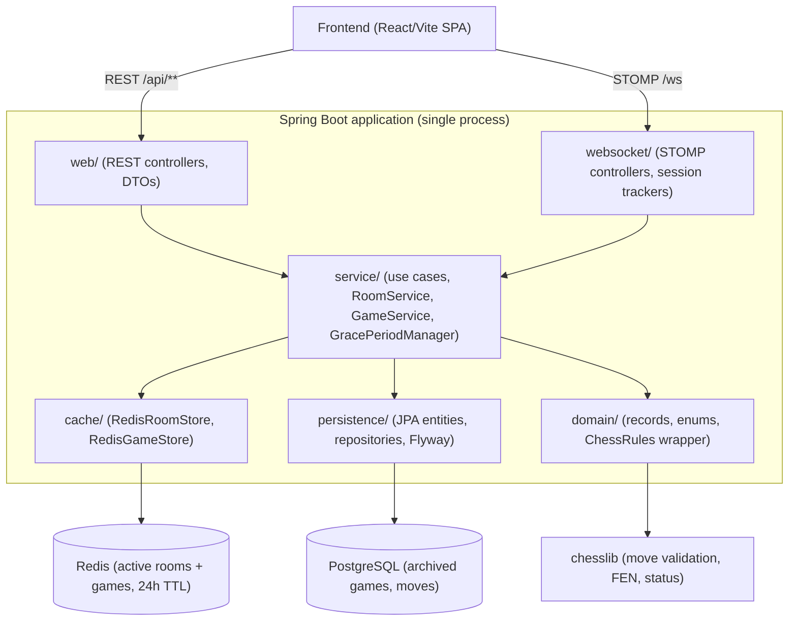
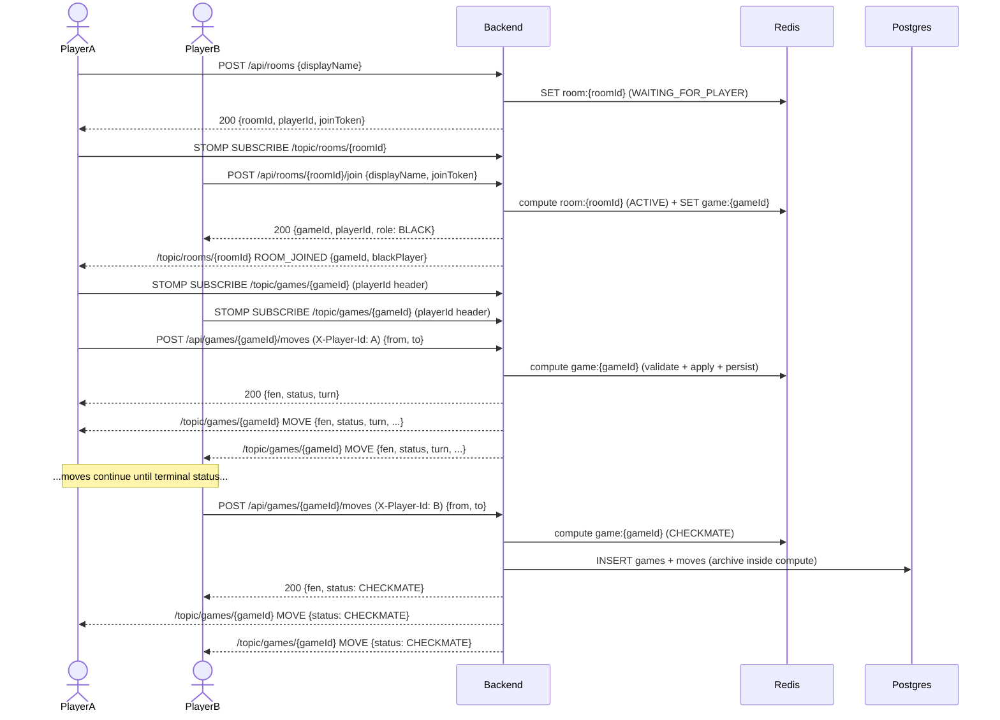

# chess-backend-java

[](https://github.com/dariogguillen/chess-backend-java/actions/workflows/ci.yml)

Multiplayer chess backend in Java/Spring Boot, deployed to AWS Free Tier. Server-authoritative move validation (chesslib + position-history replay), real-time STOMP broadcasts with sealed-event discriminator, Postgres + Redis split for durable history vs. active state, and a disconnect/reconnect grace-period lifecycle. Built as a portfolio rewrite of an earlier Node prototype, coordinated end-to-end by a leader/implementer/reviewer agent harness.

## Try it live

- **Frontend:** <https://chess-frontend-52i.pages.dev/> — React/Vite SPA on Cloudflare Pages.
- **Backend health:** <https://chess-backend.duckdns.org/api/health> — liveness probe; returns 200 OK with status, version, timestamp.
- **API docs (Swagger UI):** <https://chess-backend.duckdns.org/swagger-ui/index.html> — interactive REST surface.

Open the frontend in two browsers (Firefox + Chrome works well), create a room in one, paste the room code into the other to join, and play.

## What this demonstrates

- **Server-authoritative move validation.** Every move is checked against `chesslib` with the full position history replayed for threefold-repetition and 50-move-rule detection. The client cannot inject an illegal move; the previous Node prototype trusted the browser, this version does not.
- **Real-time broadcasts over STOMP with sealed-event discriminator.** Polymorphic topics (`/topic/rooms/{roomId}`, `/topic/games/{gameId}`) carry a `sealed interface` of event variants, each with an explicit `type` field set in its convenience constructor. No `@JsonTypeInfo` reflection, no shape-based discrimination on the client.
- **Postgres + Redis split with per-key atomicity.** Redis owns active state (24h TTL on `room:{id}` / `game:{id}`) behind a `StripedKeyLock` for single-instance serialization; Postgres owns the read-only archive of finished games, written transactionally inside the same `compute` block as the terminal-state mutation.
- **Disconnect/reconnect lifecycle with grace period.** A STOMP session drop schedules a one-shot 60-second abandon timer; a resubscribe with the matching `playerId` native header cancels it. `PlayerDisconnectedEvent` and `PlayerReconnectedEvent` drive the opponent's "reconnecting..." banner with an absolute `gracePeriodEndsAt` deadline.
- **Production deploy on AWS Free Tier with OIDC CI/CD.** EC2 + RDS + ECR provisioned by Terraform; Caddy terminates TLS via Let's Encrypt at `chess-backend.duckdns.org`; GitHub Actions authenticates to AWS via federated OIDC (no static keys anywhere) and gates each release on a `/api/health` smoke test.
- **Leader/implementer/reviewer agent harness with persisted state.** Three role files in `.claude/agents/` separate planning, execution, and verification. State outlives chat: scope in `feature_list.json`, active session in `progress/current.md`, audit trail in `progress/history.md`, learning notes in `notes/`.
- **212 tests with Testcontainers — no H2, no in-memory fakes.** Integration tests boot a real Postgres and Redis via Testcontainers and exercise the system through the REST + STOMP surfaces. Unit tests cover the domain layer (chess rules, edge cases) where a context boot would be wasted overhead.

## Architecture



Dependency direction is strictly top-to-bottom; lower layers do not know about higher layers. See [`docs/architecture.md`](docs/architecture.md) for the full reasoning.

## End-to-end flow



The companion `chess-frontend` repo lives at <https://github.com/dariogguillen/chess-frontend>.

## Stack

- Java 21
- Spring Boot 3 (Spring MVC, Spring WebSocket, Spring Data JPA, Spring Data Redis)
- PostgreSQL + Flyway
- Redis
- WebSocket (STOMP, in-process `SimpleBroker`)
- `chesslib` for move validation, FEN handling, and status detection
- springdoc-openapi for the OpenAPI 3 spec + Swagger UI
- JUnit 5 + Testcontainers (real Postgres, real Redis — no H2, no in-memory fakes)
- Docker (multi-stage build) + Docker Compose
- Caddy (TLS termination via Let's Encrypt) + Terraform (AWS infra)
- Maven

## Running locally

The application ships three workflows. Pick the one that matches your task: fast inner-loop iteration, a production-like containerized run, or a hybrid where the IDE drives the app and Docker drives the infrastructure.

### With Testcontainers (primary dev loop)

`./mvnw spring-boot:test-run` boots the app with Testcontainers-managed Postgres and Redis. No Docker image build is required; Spring Boot's `spring-boot.run.test-only` hook applies the `@TestConfiguration` containers automatically. Use this for everyday development — it is the fastest path from change to running app.

```bash
./mvnw spring-boot:test-run
```

### With docker-compose (production-like stack)

`docker compose up --build` brings up Postgres, Redis, and the containerized app. The first build pulls base images and resolves Maven dependencies (~2–3 minutes); subsequent builds reuse the cached layers (~30s when only sources change). Use this to validate the actual deployment artifact end-to-end before opening a PR.

```bash
docker compose up --build
# stop and clean volumes when done
docker compose down -v
```

### Hybrid (Docker infra + IDE-attached app)

`docker compose up postgres redis -d` brings up only the dependencies, and `./mvnw spring-boot:run` runs the app on the host against them via the published ports (`localhost:5432`, `localhost:6379`). Use this for debugging when you want breakpoints attached to the app process.

```bash
docker compose up postgres redis -d
./mvnw spring-boot:run
```

Configuration follows the env-var-with-default pattern in `application.yml`: the same artifact runs locally, under Compose, and in production by overriding `SPRING_DATASOURCE_*` and `SPRING_DATA_REDIS_*` at start time.

## API

The application exposes a small REST surface: a liveness probe, the room lifecycle (create / join / read), and the game endpoints (read state, apply moves, list a player's archived games).

### API documentation

The HTTP API is documented via an auto-generated OpenAPI 3 spec.

- Interactive Swagger UI: <http://localhost:8080/swagger-ui.html>
- Machine-readable JSON spec: <http://localhost:8080/v3/api-docs>

To import into Insomnia or Postman, create a new collection from the `/v3/api-docs` URL.

### Quick curl examples

Room IDs are case-insensitive in URLs; responses always return the canonical uppercase form.

```bash
# Health probe.
curl http://localhost:8080/api/health

# Create a room (caller becomes WHITE). The response carries a secret
# joinToken — only the creator obtains it; share it with the opponent.
curl -X POST http://localhost:8080/api/rooms \
  -H 'Content-Type: application/json' \
  -d '{"displayName":"Alice"}'

# Join an existing room (caller becomes BLACK; game is created). The
# joinToken from the create response is required — the roomId alone (used
# for watching) does not authorise joining. A missing or wrong token
# returns 403 INVALID_JOIN_TOKEN.
curl -X POST http://localhost:8080/api/rooms/K7M3X9/join \
  -H 'Content-Type: application/json' \
  -d '{"displayName":"Bob","joinToken":"<joinToken-from-create-response>"}'
```

### Games

```bash
# Read the current state of a game.
curl -X GET http://localhost:8080/api/games/<gameId>

# Apply a move (caller identified by X-Player-Id).
curl -X POST http://localhost:8080/api/games/<gameId>/moves \
  -H "Content-Type: application/json" \
  -H "X-Player-Id: <playerId>" \
  -d '{"from": "e2", "to": "e4"}'
```

### Authentication (optional)

Guest play stays open on every existing surface; an account unlocks "review my past games" (feature 19) and is the foundation for future per-user features. Three sign-in paths converge on the same `User` and the same JWT shape:

- `POST /api/auth/register` — `{ email, password, displayName }` → `201 { token, user }`.
- `POST /api/auth/login` — `{ email, password }` → `200 { token, user }`.
- Or sign in with Google — navigate the browser to `/oauth2/authorization/google`. The backend handles the OAuth dance, mints a JWT, and redirects to the frontend's `/auth/callback#token=<jwt>` so the frontend can read the token from the URL fragment. The Google sign-in path requires `GOOGLE_OAUTH_CLIENT_ID` / `GOOGLE_OAUTH_CLIENT_SECRET` / `AUTH_OAUTH_FRONTEND_REDIRECT_BASE` env vars at boot; see [`docs/architecture.md`](docs/architecture.md) → "Authentication → Google OAuth 2.0 sign-in" for the operator setup.

The returned `token` is a stateless HS256 JWT (7-day lifetime). Send it back as `Authorization: Bearer <token>` on subsequent requests to authenticated endpoints. Today the auth-required surface is:

- `GET /api/me` — returns the authenticated user (`{ id, email, displayName, createdAt }`; `createdAt` is the "member since" timestamp, added in feature 23.91).
- `PATCH /api/me` — `{ displayName }` → `200` with the updated `MeResponse`. Renames the display name (`@NotBlank`, ≤100 chars; a blank or too-long value → `400 VALIDATION_FAILED`). The rename reflects live in the friends list but not in past games (those snapshot the name at archive time).
- `PUT /api/me/password` — `{ currentPassword, newPassword }` → `204`. Verifies the current password against the stored hash, then sets the new BCrypt hash (`newPassword` is 8–72 chars; a weak/oversized value → `400 VALIDATION_FAILED`). A wrong current password — or an OAuth-only account that has no password set — returns `401 INVALID_CREDENTIALS`, with no leak of which case applied. Existing JWTs are not revoked (the tokens are stateless).
- `GET /api/me/games?page=&size=` — returns the authenticated user's archived games, newest first, in the standard Spring Data `Page` envelope. Pagination params are `page` (default 0, min 0) and `size` (default 20, min 1, max 100). Authenticated game creation (`POST /api/rooms` / `POST /api/rooms/{id}/join` with a Bearer token) populates `games.white_user_id` / `games.black_user_id` so this endpoint can find them.
- `GET /api/me/stats` — returns the caller's aggregate win/loss/draw record: `{ total, wins, losses, draws, unknown, winRate }`. The buckets reconcile (`total == wins + losses + draws + unknown`); `unknown` holds legacy `NULL`-result games (old `ABANDONED` rows whose winner is unrecoverable), counted in `total` but excluded from W/L/D and from the `winRate` denominator. `winRate = wins / (wins + losses + draws)` as a double, `0.0` when there are no decided games. Computed by one JPQL conditional-sum query, not by loading the game list. Bot games are included (the human side carries the user id); a vs-human-only split is a later follow-up.
- `GET /api/me/games/{id}` — returns ONE archived game with its FULL ordered move list for replay: `MyGameDetail { gameId, roomId, whiteDisplayName, blackDisplayName, selfSide, status, result, startingFen, finalFen, endedAt, moves }`, where each move is `{ from, to, promotion }` in lowercase algebraic notation (`promotion` nullable). `selfSide` lets the UI orient/flip the board. The caller must be a participant; a non-participant, an unknown id, and an anonymous game (both user ids null) **all** return the same `404 GAME_NOT_FOUND` (no leak). The moves are loaded with a `LEFT JOIN FETCH`, so a terminal game with zero moves still returns `200` with an empty `moves` array. Added in feature 23.94 (`game-review`), completing the profile-support arc.

#### Friends (feature 23.8)

Authenticated users build a mutual friends list discovered by a shareable **friend code** (each account gets a stable 8-char code; you add someone by entering their code, not by searching the user base). The relationship is symmetric request/accept — A sends a request, B accepts or rejects, either party can cancel or remove. All routes require a Bearer JWT; pagination follows the same `page` / `size` contract as `/api/me/games`.

- `GET /api/me/friend-code` — the caller's shareable code → `200 { friendCode }`.
- `POST /api/me/friends/requests` — `{ friendCode }` → `201`. Errors: `404 FRIEND_CODE_NOT_FOUND`, `422 SELF_FRIENDSHIP`, `409 ALREADY_FRIENDS`, `409 DUPLICATE_FRIEND_REQUEST`.
- `POST /api/me/friends/requests/{id}/accept` — addressee accepts → `204`; `404 FRIEND_REQUEST_NOT_FOUND` otherwise (same code whether the request is missing or the caller is not its addressee — no existence leak).
- `DELETE /api/me/friends/requests/{id}` — cancel (requester) or reject (addressee) → `204`.
- `DELETE /api/me/friends/{userId}` — remove an accepted friend → `204`; `404 FRIEND_NOT_FOUND`.
- `GET /api/me/friends?page=&size=` — accepted friends, projecting each friend's live display name, friend code, and `friendsSince`.
- `GET /api/me/friends/requests/incoming?page=&size=` and `GET /api/me/friends/requests/outgoing?page=&size=` — pending requests where the caller is the addressee / requester respectively.

Full request/response shapes live in the Swagger UI linked above.

#### Invitations (feature 23.9)

Invite an accepted friend to a room you created. Create a FRIEND room (`POST /api/rooms`, which returns a `joinToken`), then invite a friend by user id. The invitee gets a real-time push on the per-user STOMP queue (below) if connected, and can also list pending invitations over REST. Accepting performs the room join **server-side** using the stored join token — the token never reaches the invitee's client — so the inviter is notified by the existing `ROOM_JOINED` event on `/topic/rooms/{roomId}`. Invitations are ephemeral (stored in Redis, tied to the room's 24h TTL; no migration) and re-validated against the live room at read/accept time. All routes require a Bearer JWT; path `{roomId}` is case-insensitive.

- `POST /api/me/invitations` — `{ roomId, friendUserId }` → `201`. Errors: `404 FRIEND_NOT_FOUND` / `ROOM_NOT_FOUND`, `403 NOT_ROOM_MEMBER`, `409 ROOM_FULL`. Re-sending the same `(room, invitee)` is idempotent.
- `GET /api/me/invitations` — the caller's live incoming invitations (`roomId`, `inviterUserId`, `inviterDisplayName`, `timeControl`, the `side` the invitee would take, `createdAt`); stale ones are pruned.
- `POST /api/me/invitations/{roomId}/accept` — joins the room as the second player → `200` `RoomResponse` (`roomId`, `playerId`, `role`, `gameId`); `404 INVITATION_NOT_FOUND`, `409 ROOM_FULL`.
- `DELETE /api/me/invitations/{roomId}` — invitee declines → `204`; pushes `INVITATION_DECLINED` to the inviter's queue.
- `DELETE /api/me/invitations/{roomId}/to/{inviteeUserId}` — inviter cancels → `204`; pushes `INVITATION_CANCELLED` to the invitee's queue; `403 NOT_ROOM_MEMBER`.

Full request/response shapes live in the Swagger UI linked above.

### WebSocket (STOMP)

Live game updates are pushed over STOMP-over-WebSocket. After every successful `POST /api/games/{id}/moves`, the server broadcasts a `MoveEvent` to subscribers of the game's topic.

- Endpoint: `ws://localhost:8080/ws`
- Subscribe to `/topic/games/{gameId}` to receive `GameStateEvent` variants (`MOVE`, `GAME_ABANDONED`, `PLAYER_DISCONNECTED`, `PLAYER_RECONNECTED`) — each carries an explicit `type` discriminator field.
- Subscribe to `/topic/rooms/{roomId}` to receive `RoomEvent` variants (today: `ROOM_JOINED`) — same discriminator pattern.
- Subscribe to `/topic/games/{gameId}/viewers` to receive a `ViewerCountEvent` on every spectator join/leave. Players self-exclude from the count by sending a `playerId:<uuid>` native STOMP header on their `SUBSCRIBE` to `/topic/games/{gameId}`.
- Subscribe to `/user/queue/invitations` (feature 23.9, **authenticated CONNECT required**) to receive your own invitation events: `INVITATION_RECEIVED` (someone invited you), `INVITATION_DECLINED` (an invitee you invited declined), `INVITATION_CANCELLED` (an inviter cancelled). This is a per-user private destination — delivered to your session(s) by your STOMP principal — so an anonymous CONNECT receives nothing here.
- Optional: send `Authorization: Bearer <jwt>` as a native STOMP header on the CONNECT frame to identify the session. Anonymous CONNECT is still supported (guest play unchanged); a bad or missing JWT does not reject the connection. When the JWT is valid, the server blocks identity spoofing on SEND / SUBSCRIBE frames whose `playerId` does not match the authenticated user. See [`docs/architecture.md`](docs/architecture.md) → "Authentication → WebSocket trust model (feature 20)" for the two-phase interceptor contract and the "ERROR-but-no-disconnect" rejection model.

See [`docs/architecture.md`](docs/architecture.md) → "STOMP API contract" for the full contract (payload shapes, allowed origins, failure mode, viewer count broadcasts, the `playerId` header convention, and the `GameStateEvent` family).

Smoke-test from the terminal with [`wscat`](https://github.com/websockets/wscat) (any STOMP-aware client works the same way):

```bash
# Connect to the WS endpoint.
wscat -c ws://localhost:8080/ws

# Once connected, paste the STOMP frames (each ends with a NUL byte,
# typed as ^@ in most terminals):
# CONNECT
# accept-version:1.2
# host:localhost
#
# ^@
#
# SUBSCRIBE
# id:sub-0
# destination:/topic/games/<gameId>
#
# ^@
```

## Deployment

The backend is deployed to AWS Free Tier (EC2 + RDS + ECR) with Caddy terminating HTTPS via Let's Encrypt at <https://chess-backend.duckdns.org>. Infrastructure lives in [`infra/`](infra/) (Terraform). The full step-by-step deploy procedure — `terraform apply`, Duck DNS, image transfer, smoke test, troubleshooting — is in [`docs/deploy-runbook.md`](docs/deploy-runbook.md).

Pushes to `main` deploy automatically via [`.github/workflows/deploy.yml`](.github/workflows/deploy.yml): the workflow authenticates to AWS via OIDC (no static keys), builds and pushes the Docker image to ECR, SSHes into the EC2 to pull and restart the container, and smoke-tests `/api/health` before reporting green. PRs targeting `main` are gated by [`.github/workflows/ci.yml`](.github/workflows/ci.yml), which runs `./init.sh` on the candidate branch. Both workflows share the JDK-setup + verify steps via the composite action at `.github/actions/build/action.yml`. The manual procedure in the runbook remains the fallback and the single source of truth for what each automated stage is doing.

## Engineering process

This repo is coordinated by an agent harness with three explicit roles and on-disk state that survives across chat sessions. The shape is recruiter-grade differentiation: the same discipline a senior engineer would expect from a code reviewer is encoded in files, not in memory.

- [`CLAUDE.md`](CLAUDE.md) — entry-point orchestration rules. Every session starts here; this file pins the agent to the `leader` role and lists the four files to read on session start.
- [`AGENTS.md`](AGENTS.md) — project map for any agent walking in cold. Points at where information lives (architecture, conventions, scope, verification) so the agent looks things up on demand rather than carrying everything in context.
- [`.claude/agents/leader.md`](.claude/agents/leader.md) — decomposes scope into features and coordinates the implementer/reviewer cycle. Never writes code. Owns `feature_list.json` status transitions.
- [`.claude/agents/implementer.md`](.claude/agents/implementer.md) — executes the locked plan exactly. Never picks scope, never self-reviews. Ships code, tests, and the feature note in `notes/` as a single deliverable.
- [`.claude/agents/reviewer.md`](.claude/agents/reviewer.md) — walks [`CHECKPOINTS.md`](CHECKPOINTS.md) and approves or rejects with specific, file-pinned issues. Rejects on missing or empty feature notes.
- [`feature_list.json`](feature_list.json) — single source of truth for scope, ordered by priority. Only the leader flips `status` (`pending` → `in_progress` → `done`).
- [`progress/current.md`](progress/current.md) and [`progress/history.md`](progress/history.md) — persisted session state. `current.md` is the active feature's plan; `history.md` is the append-only audit trail of every feature closed.
- [`notes/`](notes/) — feature-by-feature learning trail, one note per feature at `notes/NN-<feature-id>.md`. Required deliverable; the reviewer rejects features that ship without one.

Verification is performed exclusively by [`./init.sh`](init.sh) — a single script that compiles, lints, and runs the full test suite. Only a green run counts as evidence that a feature is complete.

## Repository structure

```
chess-backend-java/
├── .claude/agents/                     # leader / implementer / reviewer role definitions
├── .github/
│   ├── actions/build/                  # composite action: JDK setup + ./init.sh
│   └── workflows/                      # ci.yml (PR gate) + deploy.yml (push to main)
├── docs/                               # architecture, conventions, deploy runbook, verification
├── infra/                              # Terraform sources for the AWS Free Tier stack
├── notes/                              # feature notes (one per feature, NN-<feature-id>.md)
├── progress/                           # current.md (active session) + history.md (audit trail)
├── src/
│   ├── main/java/io/github/dariogguillen/chess/
│   │   ├── config/                     # @Configuration classes
│   │   ├── domain/                     # records, enums, ChessRules wrapper
│   │   ├── service/                    # use cases (RoomService, GameService, ...)
│   │   ├── web/                        # REST controllers + request/response DTOs
│   │   ├── websocket/                  # STOMP controllers + session trackers + event DTOs
│   │   ├── persistence/                # JPA entities + Spring Data repositories
│   │   ├── cache/                      # Spring Data Redis stores
│   │   └── exception/                  # exception hierarchy + global handler
│   ├── main/resources/                 # application.yml, Flyway migrations
│   └── test/java/                      # mirrors main layout; *IT integration, *Test unit
├── AGENTS.md                           # project map
├── CHECKPOINTS.md                      # "done" checklist used by the reviewer
├── CLAUDE.md                           # entry-point orchestration rules
├── docker-compose.yml                  # local Postgres + Redis + app
├── docker-compose.prod.yml             # production compose (Redis + app, no Postgres; RDS in prod)
├── Dockerfile                          # multi-stage build (JDK + Maven builder, JRE runtime)
├── feature_list.json                   # scope, ordered by priority
├── init.sh                             # compile + lint + test; the verification gate
└── pom.xml
```

## Out of scope (deliberate)

These items were considered and explicitly deferred. They are documented here so reviewers see the boundaries as decisions, not gaps.

- **Authentication beyond the auth bundle (features 16–20).** Email/password, Google OAuth, JWT issuance + validation, per-user game history, and JWT-validated STOMP CONNECT with identity-spoof prevention are all in place; refresh tokens, password reset, email verification, 2FA, account linking, and multi-provider OAuth (Apple, GitHub, ...) are deliberately deferred. Guests still play anonymously; an account unlocks "review my past games" and identity-strengthened STOMP sessions.
- **Ratings (ELO).** The data model leaves room for it (the archive stores per-player UUIDs and display names); no implementation today.
- **Tournament structure.** One game at a time per room.
- **Move clocks / time controls.** Possible future feature; the `GameStatus` enum and the move-archive schema leave room without a migration.

## License

GPL-3.0
