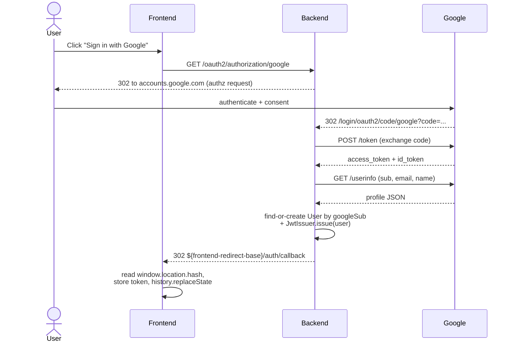

# Architecture

This document describes what "good work" looks like in this project. It
covers the architectural decisions, the reasoning behind them, and the
boundaries between components. If a decision is not documented here and
not obvious from the code, prefer **the simplest standard Spring Boot
approach** and surface the question with the user.

---

## High-level shape

A single Spring Boot servlet application. Not microservices, not modular
monolith. One process, one deployable, one `pom.xml`.

The application exposes:

- **REST endpoints** under `/api/...` for state-changing actions
  (create room, make a move, query state).
- **STOMP over WebSocket** at `/ws` for real-time broadcasts to clients
  in a room.
- A **health endpoint** at `/api/health` for liveness and version info.

The application depends on two external systems:

- **PostgreSQL** for durable state (completed games, players).
- **Redis** for ephemeral state (active rooms, active games, player
  connection state).

Both are managed via Docker Compose locally and via Testcontainers in
integration tests.

## Layered architecture

The dependency direction is strictly top to bottom. Lower layers do not
know about higher layers.

```
web / websocket
       │
       ▼
    service
       │
       ▼
  persistence / cache / domain (chesslib)
```

- **`web/`** holds REST controllers. Controllers translate HTTP to
  service calls and back. They never call repositories directly.
- **`websocket/`** holds STOMP controllers. Same role for WebSocket
  traffic.
- **`service/`** holds application services. Services orchestrate
  domain operations, validation, persistence, and broadcasting. This
  is where transactional boundaries live.
- **`domain/`** holds entities, value objects, and pure domain logic
  (e.g., wrappers over chesslib). No Spring annotations here if
  possible.
- **`persistence/`** holds JPA repositories and Postgres-backed code.
- **`cache/`** holds Spring Data Redis repositories and caching
  utilities.
- **`exception/`** holds the exception hierarchy and the global
  `@RestControllerAdvice`.
- **`config/`** holds `@Configuration` classes (WebSocket, security
  later, etc.).

`service/` may introduce its own value types when the domain shape does
not match the service's computational needs. For example, `ChessRules`
operates on a service-level `GameState` record (`startingFen + history +
cached current views`) rather than the domain `Game`, because chess-rule
decisions need position history but not player identity. Such
service-level types live alongside the service that consumes them and
are mapped to and from domain types at the service boundary.

`service/` also holds the **storage seams** for active state: small
interfaces like `RoomStore` and `GameStore`. Feature 8 wired the
Redis-backed implementations — `cache/RedisRoomStore` and
`cache/RedisGameStore` — as the registered beans, replacing the day-one
`InMemory*` adapters without any change to `RoomService` or consumers
above the service layer. Putting the interfaces in `service/` and their
implementations in `cache/` keeps the port next to its sole consumer
while the adapters live alongside other Redis-backed code. The TTL,
key schema, and atomicity model for the Redis swap are documented in
the "Active state in Redis" subsection under "State strategy" below.

### Deployment artifact

The deployment artifact is a single Docker image produced by a
multi-stage build (`Dockerfile`): a JDK + Maven wrapper builder stage
that runs `spring-boot:repackage`, and a JRE-only runtime stage that
ships nothing but the resulting fat jar. `application.yml` uses the
env-var-with-default pattern (`${SPRING_DATASOURCE_URL:jdbc:postgresql://localhost:5432/chess}`,
etc.) so the same image runs under three contexts — Testcontainers in
integration tests (via `@ServiceConnection` overrides),
`docker-compose.yml` for local stack runs (via explicit env vars
pointing at in-network hostnames), and production (features 7.5 / 7.7)
without rebuilding. `init.sh` deliberately stays scoped to "compile +
lint + test" and does **not** build the image; feature 7.7's CI workflow
will add a Docker smoke test in GitHub Actions.

The production environment provisioned by feature 7.5 is AWS Free Tier
in `us-east-2`: an EC2 t3.micro (Ubuntu 24.04 LTS) sits behind a
native-systemd Caddy that terminates TLS via Let's Encrypt for the
Duck DNS hostname `chess-backend.duckdns.org` and reverse-proxies to
the Spring Boot container on `localhost:8080`. Postgres lives in an
RDS db.t3.micro instance reachable only from the EC2 Security Group;
Redis is self-hosted in a Docker container on the same EC2 (ElastiCache
is not in the Free Tier). The production compose file
`docker-compose.prod.yml` at the repo root encodes this shape: no
Postgres service, Redis 7-alpine, the app image bound to `127.0.0.1:8080`
so Caddy is the sole inbound path. All Terraform sources live in
`infra/`; the manual deploy procedure is in `docs/deploy-runbook.md`.

### Deploy automation

Pushes to `main` trigger `.github/workflows/deploy.yml`, which is the
sole automated path to production. The workflow authenticates to AWS
via **OIDC** — a `token.actions.githubusercontent.com` federated
identity provider plus an `aws_iam_role.github_actions` role scoped to
`repo:dariogguillen/chess-backend-java:ref:refs/heads/main` — so there
are no static AWS access keys anywhere in the repo, in GitHub secrets,
or on developer machines. The job runs `./init.sh` (the same verifier
used locally), builds the production Docker image, tags it with both
the commit SHA and `latest`, and pushes both tags to the ECR
`chess-backend` repository.

After the push, the workflow SSHes into the EC2 host as the dedicated
`deploy` user (a CI-only SSH key, separate from the operator key used
for the runbook). Before restarting the stack it `scp`s the repo's
`docker-compose.prod.yml` to `/opt/chess/docker-compose.prod.yml`, so
the file compose reads is always the one committed to the repo — a
repo-to-EC2 sync on every deploy (feature 26). Before this, the
host's copy was independent of the repo's: editing the repo yml never
reached production, and config changes (e.g. a JVM memory cap) had to
be applied by hand over SSH. The sync is idempotent — an unchanged yml
is a redundant write, not a behavior change. The `/opt/chess/.env`
file is **never** touched by the workflow: it holds operator-managed
RDS credentials that must not live in the repo, so it stays managed by
hand on the EC2 host. Only the yml syncs; the `.env` does not. The
workflow then runs `docker compose pull && docker compose up -d`
against `docker-compose.prod.yml`. The EC2 pulls the new image
from ECR using an IAM **instance profile** with
`AmazonEC2ContainerRegistryReadOnly` — the host never sees long-lived
registry credentials either. A smoke test hitting
`https://chess-backend.duckdns.org/api/health` gates the workflow's
success: a non-200 response fails the run so the deploy is visibly
broken rather than silently rolled forward. Step-by-step operator
recovery still lives in `docs/deploy-runbook.md`; this section only
records the structural shape.

### API contract

The REST surface is documented via an OpenAPI 3 spec generated at
runtime by **springdoc-openapi**. The spec is served at
`/v3/api-docs` (JSON) and `/swagger-ui.html` (interactive UI). The
source of truth lives in the controllers themselves: `@Tag`,
`@Operation`, and `@ApiResponse` annotations on each `@RestController`,
plus selective `@Schema` annotations on the record DTOs. A
top-level `@Bean OpenAPI` in `config/` contributes the title,
description, and build version. The WebSocket / STOMP surface is
intentionally out of springdoc's scope; it is documented in the
"STOMP API contract" section below.

#### Error codes

All 4xx responses use the `ErrorResponse` schema. The `error` field is
constrained to the following enum, captured in the OpenAPI spec as
`components.schemas.ErrorResponse.properties.error.enum`. Clients
consuming the spec (e.g. via `openapi-typescript`) get a TypeScript
union literal automatically, without having to maintain a parallel
list on the client side.

| Code | HTTP | Source |
|---|---|---|
| `ROOM_NOT_FOUND` | 404 | `RoomNotFoundException` |
| `ROOM_FULL` | 409 | `RoomFullException` |
| `GAME_NOT_FOUND` | 404 | `GameNotFoundException` |
| `GAME_ALREADY_ENDED` | 409 | `GameAlreadyEndedException` |
| `ILLEGAL_MOVE` | 422 | `IllegalMoveException` |
| `NOT_YOUR_TURN` | 422 | `NotYourTurnException` |
| `VALIDATION_FAILED` | 400 | `MethodArgumentNotValidException` (`@Valid` failure) |
| `MALFORMED_REQUEST` | 400 | `HttpMessageNotReadableException` (unparseable JSON body) |
| `MISSING_HEADER` | 400 | `MissingRequestHeaderException` (e.g. `X-Player-Id` missing) |
| `AUTHENTICATION_REQUIRED` | 401 | `AuthEntryPoint` (Spring Security 401 entry point) |
| `EMAIL_ALREADY_TAKEN` | 409 | `EmailAlreadyTakenException` |
| `INVALID_CREDENTIALS` | 401 | `InvalidCredentialsException` |
| `INVALID_JOIN_TOKEN` | 403 | `InvalidJoinTokenException` |
| `FRIEND_CODE_NOT_FOUND` | 404 | `FriendCodeNotFoundException` |
| `FRIEND_REQUEST_NOT_FOUND` | 404 | `FriendRequestNotFoundException` |
| `FRIEND_NOT_FOUND` | 404 | `FriendNotFoundException` |
| `ALREADY_FRIENDS` | 409 | `AlreadyFriendsException` |
| `DUPLICATE_FRIEND_REQUEST` | 409 | `DuplicateFriendRequestException` |
| `SELF_FRIENDSHIP` | 422 | `SelfFriendshipException` |
| `INVITATION_NOT_FOUND` | 404 | `InvitationNotFoundException` |
| `NOT_ROOM_MEMBER` | 403 | `NotRoomMemberException` |

The first six codes are produced mechanically by `GlobalExceptionHandler`'s
`codeOf(ChessException)` derivation — simple class name minus the
trailing `Exception` suffix, converted from camelCase to
UPPER_SNAKE_CASE. The next three (`VALIDATION_FAILED`,
`MALFORMED_REQUEST`, `MISSING_HEADER`) are hardcoded literals in the
framework-exception handlers because Spring's own exception types do
not follow our naming. Three more landed with feature 17 — the
two `*Exception` subclasses follow the mechanical derivation,
`AUTHENTICATION_REQUIRED` is emitted by `AuthEntryPoint` rather than
`GlobalExceptionHandler` (it is the only 401-from-security-filter case
today), but they share the same `ErrorResponse` envelope.
`INVALID_JOIN_TOKEN` (feature 22.7, `room-access-tokens`) is the
thirteenth: `InvalidJoinTokenException` follows the mechanical
derivation and is mapped to 403 by a narrow `@ExceptionHandler` (like
`InvalidCredentialsException`'s 401, it has no umbrella superclass).
Feature 23.8 (`friends-list`) adds the six friendship codes
(`FRIEND_CODE_NOT_FOUND`, `FRIEND_REQUEST_NOT_FOUND`, `FRIEND_NOT_FOUND`,
`ALREADY_FRIENDS`, `DUPLICATE_FRIEND_REQUEST`, `SELF_FRIENDSHIP`),
bringing the total to nineteen; all six are produced mechanically by
`codeOf` from their `*Exception` subclasses, which extend the existing
`NotFoundException` / `ConflictException` / `UnprocessableException`
umbrellas, so no new `@ExceptionHandler` branch was needed.

Adding a new code requires updating both `GlobalExceptionHandler` and
`ErrorResponse.error`'s `@Schema(allowableValues = {...})`. The
`OpenApiIT` drift canary asserts the enum array matches the expected
set exactly, so forgetting one of the two halves fails the build.

#### Room create / join side selection

`POST /api/rooms` accepts an optional `preferredSide` on
`CreateRoomRequest`:

```
POST /api/rooms
{ "displayName": "Alice", "preferredSide": "BLACK" }

201 Created
{ "roomId": "K7M3X9", "playerId": "<uuid>", "role": "BLACK", "gameId": null }
```

- **`preferredSide`** — enum `WHITE | BLACK | RANDOM`. **Optional**:
  omitting it (or sending `null`) defaults to `WHITE`, so clients built
  before this feature keep the historical "creator is white" behaviour
  unchanged. `RANDOM` is resolved to a concrete side by a
  **server-side coin flip** (`RandomSideChooser`, `SecureRandom`-backed)
  so a client cannot bias the outcome — the same anti-cheat posture as
  server-side move validation. Being an enum, springdoc emits the
  allowable values into the OpenAPI schema, which `openapi-typescript`
  turns into a literal union on the frontend.
- **Create response `role`** — now reflects the **resolved** side, not a
  hardcoded `WHITE`: it can be `BLACK` when the creator asked for it (or
  when `RANDOM` flipped to black). It is always a concrete side, never
  `RANDOM`.
- **Join response `role`** — the **opposite** of the creator's chosen
  side (so a black creator yields a white joiner). The `Game`'s `white`
  / `black` players are assigned from whoever holds `WHITE`, no longer
  from join order.
- **Where the side lives** — the resolved side is persisted as
  `Room.creatorSide` (a concrete `Side`). This replaces the previous
  positional invariant "`players[0]` is always white": position now
  identifies *who* a player is (creator vs joiner), while `creatorSide`
  decides *which colour* each one plays. `Room` evolves with the same
  backwards-compatible record pattern as `Player.userId` — a
  null-tolerant compact constructor plus a 3-arg convenience constructor
  defaulting to `WHITE`, so rooms serialised into Redis before this
  deploy deserialise as white-creator rooms.

#### Time control on room create

`POST /api/rooms` accepts an optional `timeControl` on
`CreateRoomRequest` (feature 22, `time-control`):

```
POST /api/rooms
{ "displayName": "Alice", "timeControl": { "initialMs": 300000, "incrementMs": 3000 } }
```

- **`timeControl`** — `{ initialMs (>0), incrementMs (>=0) }`, or
  **omitted/null** for an untimed game (the historical behaviour; old
  frontends that never send the field keep creating untimed rooms). It
  is stored on the `Room` and read at join time to initialise the
  game's clock.
- **`GameStateResponse`** and the STOMP `MoveEvent` gain three /
  two nullable clock fields respectively — `whiteTimeRemainingMs`,
  `blackTimeRemainingMs` (both), and `lastMoveAt` (response only). They
  are `null` for an untimed game, so the wire shape is additive: a
  consumer that ignores them sees the pre-feature-22 contract.
- **New terminal status `TIMEOUT`** joins the `GameStatus` enum and
  `isTerminal()`. It is produced only server-side (the clock flag), so
  it never appears on a `MoveEvent.status` (those carry chesslib-reached
  statuses) — it surfaces on `GameStateResponse.status` and the
  `GAME_TIMED_OUT` STOMP event. No new `ErrorResponse` code: a flag is a
  terminal outcome, not a request error.

The full clock model, the no-polling flag-detection design, and the
grace/clock coexistence are documented under "Server-authoritative clock
(time control)" in the STOMP section below.

#### Bot opponent on room create

`POST /api/rooms` accepts an optional `opponentKind` (and, for bot rooms,
an optional `botElo`) on `CreateRoomRequest` (features 23 / 23.5,
`bot-opponent` / `bot-difficulty`):

```
POST /api/rooms
{ "displayName": "Alice", "preferredSide": "WHITE", "opponentKind": "BOT",
  "botElo": 1800 }

201 Created
{ "roomId": "K7M3X9", "playerId": "<uuid>", "role": "WHITE",
  "gameId": "<uuid>", "joinToken": null }
```

- **`opponentKind`** — enum `FRIEND | BOT`, **optional** (`null` /
  omitted → `FRIEND`, the historical two-human flow). `BOT` builds a
  complete vs-Stockfish game immediately, so the create response carries
  a **non-null `gameId`** (it is `null` for `FRIEND`) and **no
  `joinToken`** (there is no human to invite). `RANDOM` is *not* a value
  here — it arrives with feature 24 (`random-matchmaking`).
- **`botElo`** — `Integer`, **optional**, relevant only for `BOT`. The
  target bot strength as an Elo value, bounded by Bean Validation to
  **~400–3190** (widened down from ~1320 in feature 23.7). Omitted → the
  server's configured default (`chess.bot.default-elo`). Out of range →
  400 `VALIDATION_FAILED` (no new code). See the bot strength subsection
  for the full model.
- **No new `ErrorResponse` code.** An engine failure is a terminal game
  event (`GAME_ENGINE_FAILED` STOMP, status `ABANDONED`), not a 4xx.

The bot-move orchestration, the engine port + subprocess lifecycle, the
async executor, and the engine-failure terminal path are documented
under "Bot opponent (Fairy-Stockfish via subprocess)" in the STOMP
section below.

#### Join token — separating "can join" from "can watch"

Feature 22.7 (`room-access-tokens`) splits the capability to **join** a
room from the capability to **watch** it. Before it, the six-char
`roomId` was the single shared secret, so anyone the creator shared the
room with for spectating could `POST /api/rooms/{id}/join` and grab the
second-player slot.

- **`joinToken`** — a `UUID.randomUUID()` (122 bits, not guessable)
  minted by `RoomService.createRoom`, stored on the `Room`, and returned
  **only on the create response**:

  ```
  POST /api/rooms
  { "displayName": "Alice" }

  201 Created
  { "roomId": "K7M3X9", "playerId": "<uuid>", "role": "WHITE",
    "gameId": null, "joinToken": "<uuid>" }
  ```

- **Join requires it.** `POST /api/rooms/{id}/join` reads an optional
  `joinToken` from the request body. The validation order inside the
  atomic `RoomStore.compute` block is **room-exists (404) → token-valid
  (403) → not-full (409)**: a caller without the token gets `403
  INVALID_JOIN_TOKEN` even against a full room, so room state is never
  leaked to someone who cannot join.

  ```
  POST /api/rooms/K7M3X9/join
  { "displayName": "Bob", "joinToken": "<uuid>" }

  200 OK
  { "roomId": "K7M3X9", "playerId": "<uuid>", "role": "BLACK",
    "gameId": "<uuid>", "joinToken": null }
  ```

- **The token never leaks on the watch path.** `GET /api/rooms/{id}`
  (`RoomDetailsResponse`) has no token field, and the join response sets
  `joinToken: null` (the joiner is already in). The `roomId` alone, used
  for `GET /api/rooms/{id}` and `SUBSCRIBE /topic/rooms/{roomId}`, does
  **not** authorise joining. The frontend builds two links: a *play*
  link carrying the `joinToken` for the opponent, and a *watch* link with
  just the `roomId` for friends.

- **`null joinToken` = legacy / unprotected room (deploy safety).** The
  field is added with the same backwards-compatible record-evolution
  pattern as `creatorSide` / `timeControl`, but `null` carries a
  *security* meaning: a room serialised into Redis **before** this deploy
  deserialises with `joinToken == null`, and the token check deliberately
  short-circuits for such a room (`existing.joinToken() != null &&
  !existing.joinToken().equals(provided)`), accepting a token-less join.
  In-flight rooms keep working until they TTL out (24h); every room
  created after the deploy carries a token and is protected. This is the
  one feature in the project that is **not** silently
  backwards-compatible for the live frontend — a brand-new room created
  by the old token-unaware frontend cannot be joined — so it requires a
  coordinated backend + frontend deploy.

#### Room read endpoint

`GET /api/rooms/{id}` returns the current state of a room, used by
the frontend either as the primary discovery mechanism (Player A
polls until `gameId` is non-null and then transitions to the game
flow) or as a fallback for STOMP late subscribers, who cannot
replay events on `/topic/rooms/{roomId}`. The two mechanisms ship
together: STOMP gives sub-second push UX when the subscription
timing works, polling is the safety net when it does not.

```
GET /api/rooms/{id}

200 OK
{
  "roomId": "K7M3X9",
  "players": [
    { "id": "<uuid>", "displayName": "Alice", "role": "WHITE" },
    { "id": "<uuid>", "displayName": "Bob",   "role": "BLACK" }
  ],
  "gameId": "<uuid>",
  "status": "ACTIVE"
}
```

- **`status`** — backend-native enum: `WAITING_FOR_PLAYER`,
  `ACTIVE`, or `CLOSED`. No mapping to a presentation-specific
  vocabulary; the frontend uses the literals directly.
- **`players`** — 1 element while `WAITING_FOR_PLAYER`, 2 elements
  while `ACTIVE`. Role is **derived at the web boundary** from
  `Room.creatorSide`: index 0 is the creator and holds that side,
  index 1 (when present) is the joiner and holds the opposite. (Before
  feature 21 this was a pure index→role mapping with index 0 always
  `WHITE`.) The domain `Player` record has no `role` field — the
  deliberate trade-off keeps the domain minimal at the cost of a
  position-plus-creatorSide mapper.
- **`gameId`** — `null` while `WAITING_FOR_PLAYER` (no game has
  been created yet); non-`null` once `ACTIVE`.
- **404 `ROOM_NOT_FOUND`** — when the id does not match any room.
  Reuses the existing error code from the 9-code allowlist; no
  expansion.
- The path id is **case-insensitive**; the canonical uppercase form
  is returned in the body (matches the `POST /api/rooms/{id}/join`
  convention).
- **No path-level auth** — the room id is the shared secret, same
  posture as the rest of the API.

## Authentication

Feature 16 (`auth-core`) lands the foundation of the auth bundle
(features 16-20). This section records the bundle-level shape and the
state after feature 16 ships. Subsequent features in the bundle
(issuance, OAuth, "my games", STOMP trust) layer on top without
revisiting these decisions.

**Bundle scope.** Authentication is **optional**. Guest play stays
open on every existing surface — `POST /api/rooms`, `POST
/api/rooms/{id}/join`, `GET /api/rooms/{id}`, `POST /api/games`, `GET
/api/games/{id}`, `POST /api/games/{id}/moves`, `GET
/api/players/{id}/games`, and the STOMP `/ws` handshake all stay
anonymous. An account unlocks "review my past games" (feature 19) and
is the foundation for future per-user features. Confirmed with the
user 2026-05-27: *"seria opcional, se puede seguir jugando sin cuenta,
pero con una cuenta se pueden revisar las partidas jugadas"*.

### The `User` aggregate

A `User` represents an account: email, display name, and either a
BCrypt password hash (feature 17) or a Google `sub` claim (feature
18) — both nullable independently because the two registration paths
produce different shapes. Mapped to the `users` table created by
`V2__create_users_and_game_user_links.sql`. The `email` column has a
DB-level `UNIQUE` constraint; application code normalises to
lowercase before write so case-insensitive uniqueness is enforced at
the application boundary without Postgres CITEXT. The `google_sub`
column has a partial unique index `WHERE google_sub IS NOT NULL` so
the index ignores email-only users. Column caps are derived from the
relevant standards: `email` is `VARCHAR(254)` (RFC 5321 path max),
`password_hash` is `VARCHAR(60)` (BCrypt's fixed-length output),
`google_sub` is `VARCHAR(255)` (Google's documented `sub` upper
bound), `display_name` is `VARCHAR(100)` to match
`games.{white,black}_display_name`.

`User` is a JPA entity in the `domain` package, not a record. JPA
requires a no-args constructor and writable fields; records satisfy
neither. Mutability is contained: setters are package-private, so
only the `domain` and `persistence` packages can mutate an instance.

### Fresh-start identity model

`User.id` is the new canonical identity for authenticated users.
The link between a `User` and the games they played lives as **two
nullable FK columns directly on the `games` table** —
`white_user_id` and `black_user_id`, each `UUID NULL REFERENCES
users(id)`. There is no intermediate `players` table. This mirrors
V1's deliberate denormalisation
(`white_player_id` + `white_display_name`, same on the black side):
adding a `players` row would only duplicate the (UUID + display
name) snapshot and force a join on every history query — exactly
the shape V1 was designed to avoid.

The historical `games.white_player_id` / `games.black_player_id`
columns are kept **unchanged and without a FK to users(id)**. They
are the audit-time identity snapshot — the per-session player UUID
minted by `RoomService` when a guest creates or joins a room — and
they remain unconstrained UUIDs. Even when an authenticated user
plays a game, their `*_player_id` is the per-session identity,
independent of `users.id` by design. The display name surfaces
(`games.{white,black}_display_name`) similarly stay frozen as the
audit-correct name at game time, never rewritten by a future user
rename: same shape as Lichess game records and GitHub commit author
names.

Three rules govern the fresh-start model:

1. Anonymous games created before feature 17 ships stay anonymous
   forever — `white_user_id` and `black_user_id` are NULL and no
   backfill is ever attempted.
2. Anonymous games created during features 16-18 also stay
   anonymous: feature 16 doesn't issue tokens, and features 17-18
   issue tokens but feature 19 is the one that wires
   authenticated game creation.
3. Starting in feature 19, authenticated `POST /api/games` writes
   the matching `white_user_id` or `black_user_id` so the user's
   history query (`GET /api/me/games`) can find them via a direct
   `WHERE white_user_id = :userId OR black_user_id = :userId`.

Account linking ("I had a guest game last week, claim it to my new
account") is **explicitly out of scope** for the whole bundle.

### JWT model

- **Algorithm:** HS256 with a shared secret read from
  `AUTH_JWT_SECRET`. Symmetric is fine because issuer = verifier
  (same backend). Production fails fast at boot if the env var is
  unset; the test profile provides a fixed test secret in
  `src/test/resources/application-test.yml`.
- **Lifetime:** 7 days (`auth.jwt.expiry-seconds = 604800`). No
  refresh tokens, no revocation list — a 7-day blast radius is
  the portfolio-scale trade-off.
- **Claims:** `sub = User.id` (UUID string), `email`, `iat`, `exp`.
  No roles or authorities — the only role today is "authenticated
  user".
- **Transport:** `Authorization: Bearer <token>` on every
  request. Stateless: no session cookies, no `HttpSession`. CSRF
  protection is safely disabled because the credential is a
  script-set header, not a browser-attached cookie.
- **CORS:** `allowCredentials` stays `false` (cookies were never
  in play); the `Authorization` header is on the REST CORS
  allow-list (added by this feature alongside `X-Player-Id` from
  feature 11.7).

### Spring Security wiring

The `SecurityConfig` bean configures a `SecurityFilterChain` in the
Spring Security 6+ idiom — no deprecated
`WebSecurityConfigurerAdapter`. Key elements:

- `SessionCreationPolicy.STATELESS` — no `HttpSession` created or
  read.
- `JwtAuthenticationFilter` inserted before
  `UsernamePasswordAuthenticationFilter` — the canonical hook
  point recommended by the Spring Security reference for custom
  token filters.
- Anonymous allow-list pinned in code: the live guest play
  surface, the operational endpoints (`/api/health`,
  `/actuator/**`, `/v3/api-docs/**`, `/swagger-ui/**`), the STOMP
  handshake (`/ws/**`), and every `OPTIONS *` preflight.
  Everything else requires auth — today that means `GET /api/me`,
  the only authenticated route until feature 17 lands issuance.
- `HttpStatusEntryPoint(401)` — unauthenticated requests to
  protected endpoints return `401 Unauthorized`, not `403`. The
  body is empty by design at this stage; feature 17 may wrap the
  response in `ErrorResponse` if needed.
- `BCryptPasswordEncoder` bean exposed now — unused this feature
  but pre-wired so feature 17's `AuthService` can inject it as a
  pure-additive change.

### `GET /api/me`

Returns 200 with `{ id, email, displayName, createdAt }` on a valid
JWT; returns 401 (with a structured `ErrorResponse` body — see "401
entry point" below) on a missing, malformed, expired, or
differently-signed JWT. Used as the frontend's "is my stored token
still valid?" probe and as the regression-locking surface for the auth
filter chain.

`createdAt` (an ISO-8601 instant, the account's "member since"
timestamp) was added by feature 23.91 (`profile-edit`). It is on the
`User` entity already; the field was simply surfaced on `MeResponse`.
All three construction sites of that payload — `MeController`,
`AuthService` (register/login), and the new `ProfileService` — now go
through a single `MeResponse.of(User)` factory, so `AuthResponse.user`
on register/login carries `createdAt` too (additive, no breaking
change).

### JWT issuance (feature 17)

Feature 17 (`auth-jwt`) lands the issuance side and the two
user-visible endpoints that produce tokens:

- **`POST /api/auth/register`** — `{ email, password, displayName }`
  → `201` with `{ token, user: { id, email, displayName } }`. The
  email is normalised to lowercase, the password is BCrypt-hashed
  (the encoder bean wired by feature 16, default cost factor 10),
  and the JWT is minted from the freshly created `User`. The whole
  flow is `@Transactional`: the application-level
  `UserRepository.findByEmail` uniqueness check and the insert run
  in one transaction; the database-level `UNIQUE` constraint on
  `users.email` closes the race between two concurrent registrations
  by translating the duplicate insert into
  `DataIntegrityViolationException`, which the service catches and
  rethrows as `EmailAlreadyTakenException` (409 /
  `EMAIL_ALREADY_TAKEN`). Validation failures (malformed email,
  password outside 8-72 chars, blank display name) surface as 400 /
  `VALIDATION_FAILED` via the existing
  `MethodArgumentNotValidException` handler.

- **`POST /api/auth/login`** — `{ email, password }` → `200` with the
  same `{ token, user }` envelope. The email is normalised the same
  way; the BCrypt encoder's `matches(rawPassword, storedHash)` does
  the constant-time comparison. The failure path is uniform: an
  unknown email and a wrong password both throw
  `InvalidCredentialsException` (401 / `INVALID_CREDENTIALS`) with
  the same message ("Invalid email or password"). The service also
  runs the BCrypt comparison against a pre-computed dummy hash on
  the unknown-email branch so the response time does not leak
  whether the email exists.

- **Password-policy leak avoidance.** `RegisterRequest.password`
  carries `@Size(min = 8, max = 72)`; `LoginRequest.password`
  carries no `@Size` annotation. A wrong-length password on login
  is a credentials error (401), not a validation error (400) —
  surfacing "password too short" on login would tell an attacker the
  policy bounds, which is one bit of information they should not
  get from a failed login attempt. The 72-byte cap on register
  matches BCrypt's input block-size limit (passwords longer than 72
  bytes are silently truncated by the algorithm).

The issuance side uses a `JwtIssuer` bean — counterpart to feature
16's `JwtVerifier` — both classes derive the HS256 `SecretKey` from
`AuthProperties.secret` via the same `Keys.hmacShaKeyFor` call, so
their key bytes are identical and the round-trip is byte-for-byte
guaranteed. The integration test `AuthEndpointsIT.roundTrip_*` pins
this: a token minted by `/api/auth/login` is accepted by feature
16's `JwtAuthenticationFilter`, and a subsequent `GET /api/me` with
that token returns the same user. `JwtIssuer` injects the
application's `Clock` bean so the `iat` / `exp` claims are testable
(swap in `Clock.fixed(...)` via a `@Primary` test bean to assert
expiry behaviour).

### 401 entry point

Feature 17 swapped feature 16's `HttpStatusEntryPoint(401)`
placeholder for a custom `AuthEntryPoint` that writes a structured
`ErrorResponse` body to every 401 emitted by the security filter
chain. The body shape is the same envelope `GlobalExceptionHandler`
produces for the other 4xx codes — `{ error, message, timestamp }`
— with `error = "AUTHENTICATION_REQUIRED"` and a generic message
("Authentication is required to access this resource."). The
message is intentionally uniform: missing header, expired token, and
forged token all surface identically, mirroring
`JwtAuthenticationFilter`'s policy of not logging the specific JWT
failure reason in the response.

### Profile editing (feature 23.91)

Feature 23.91 (`profile-edit`) rounds out the authenticated user's
own-profile surface with two write endpoints on the existing
`/api/me` resource, plus the `createdAt` exposure described under
`GET /api/me` above. No Flyway migration — the `created_at`,
`display_name`, and `password_hash` columns already exist; this
feature only touched the DTO/service/controller layers.

| Method & path | Body | Success | Errors |
| --- | --- | --- | --- |
| `PATCH /api/me` | `{ displayName }` | `200` updated `MeResponse` | 400 `VALIDATION_FAILED` (blank / >100 chars), 401 |
| `PUT /api/me/password` | `{ currentPassword, newPassword }` | `204` no body | 400 `VALIDATION_FAILED` (newPassword blank / outside 8-72), 401 `INVALID_CREDENTIALS` (wrong current, or OAuth-only account), 401 (no token) |

- **Two endpoints, not one.** A display-name rename and a password
  change have different bodies, different success codes (200 with a
  body vs 204), and different security posture (the password change
  must verify the current password). They are kept as separate
  operations rather than a single `PATCH` with optional fields.
- **Email is not editable here.** It is the unique login identity and
  would need a re-verification flow; out of scope.
- **OAuth-only accounts** (those with a `null` `password_hash`) cannot
  change their password: `PasswordEncoder.matches(current, null)`
  returns `false`, so the attempt fails with the same 401
  `INVALID_CREDENTIALS` as a wrong current password — no new error
  code, and no leak of whether the account is OAuth-only. No new error
  codes are introduced (`ErrorResponse`'s allowable-values canary
  stays at 21).
- **No JWT re-issue on either change.** A display-name rename does not
  touch any JWT claim (`sub` = userId, the only identity claim is
  `email`), so existing tokens stay valid as-is. A password change
  *cannot* revoke existing stateless tokens — there is no server-side
  token store — so the old token remains valid until it expires; this
  is the accepted trade-off of the stateless-JWT model.
- **The service mutates a managed entity.** `ProfileService` re-loads
  the `User` by id inside a `@Transactional` method and mutates it
  through intention-revealing domain methods (`User.rename`,
  `User.changePasswordHash`), relying on Hibernate dirty-checking to
  flush. It deliberately does *not* mutate the detached
  `@AuthenticationPrincipal User` the controller resolves — that
  instance is bound to a closed persistence context and the change
  would not persist.

**Snapshot vs live on rename.** A display-name change reflects
*live* in the friends list (feature 23.8 projects each friend's
display name via an entity join at query time), but *not* in past
games: the `games` table snapshots `white_display_name` /
`black_display_name` at archive time (feature 9, denormalised by
design). This is intentional audit semantics — a finished game shows
the name the player used when it was played.

### Google OAuth 2.0 sign-in (feature 18)

Feature 18 (`auth-google-oauth`) adds Google as a second sign-in
path that converges on the same `User` aggregate and the same JWT
shape feature 17 locked. Spring Security's `oauth2Login` DSL
handles roughly 80% of the flow — the authorization redirect to
Google, the code-for-token exchange, and the userinfo fetch that
produces an `OAuth2User` principal. The remaining 20% is the
custom `OAuth2SuccessHandler`: it find-or-creates the `User` keyed
by Google's `sub` claim, mints a JWT via the existing `JwtIssuer`
(byte-for-byte interchangeable with one minted by
`/api/auth/login`), and redirects the browser to the configured
frontend with the token in the URL fragment.



**Why the URL fragment, not the query string.** Fragments are not
sent to the server in subsequent requests, so even if an
intermediate proxy logs full URLs, the token cannot leak into a
backend's request log. A query parameter (`?token=…`) would appear
in Caddy's access log, in CloudWatch, and in any browser-history
exporter — the fragment hides it from all three.

**Identity-collision policy ("Option B").** The handler does NOT
silently merge identities when a fresh Google `sub` arrives with an
email that is already taken by an email/password account from
feature 17. That is the "no account linking" out-of-scope decision
for the bundle. Instead, the handler redirects to
`${frontend-redirect-base}/auth/callback#error=email_taken`, and
the frontend renders a user-facing "this email is already
registered with a password; please sign in with email/password
instead." message. A missing-required-attribute case (no `sub` or
no `email` on the OAuth2User) similarly surfaces as a soft
fragment-error redirect (`#error=oauth_missing_profile`), not a
500 — the user did nothing wrong and a server-error page would be
the wrong UX.

**`passwordHash = null` for OAuth-only users.** The OAuth path
creates `User` rows with `passwordHash = null`, NOT an empty
string. BCrypt would happily hash an empty string into a
valid-looking BCrypt output, and the `BCryptPasswordEncoder.matches`
call would then accept any `""` password — a phantom-loginable user.
Null short-circuits the matches path entirely.

**Log hygiene.** The OAuth failure paths emit warnings with NO
personally identifiable information — no email, no Google `sub`,
no display name. The messages are deliberately generic ("OAuth
callback missing required profile attributes", "OAuth callback for
email already registered to a different identity"). This is a
defence-in-depth posture: the JWT in the success-path redirect is
the only OAuth-related data on the wire, and that lives in the
fragment.

**Allow-list dance.** `/oauth2/**` (Spring Security's
authorization-request endpoint) and `/login/oauth2/**` (the
callback) MUST stay anonymous. They are reached BEFORE the user is
authenticated; requiring auth here would deadlock the OAuth dance
(the user cannot authenticate without first being authenticated).

#### Operator setup

The Google OAuth client is provisioned outside this repo. The
one-time setup steps:

1. In **Google Cloud Console**, create or pick a project.
2. Navigate to **APIs & Services → Credentials → Create credentials
   → OAuth 2.0 Client ID**. Application type: **Web application**.
3. Set the **authorised redirect URIs** to both environments:
   - `https://chess-backend.duckdns.org/login/oauth2/code/google`
     (production)
   - `http://localhost:8080/login/oauth2/code/google` (local dev)
4. Capture the **client-id** and **client-secret**.
5. On the EC2 host, add to `/opt/chess/.env`:
   - `GOOGLE_OAUTH_CLIENT_ID=…`
   - `GOOGLE_OAUTH_CLIENT_SECRET=…`
   - `AUTH_OAUTH_FRONTEND_REDIRECT_BASE=https://chess-frontend-52i.pages.dev`
6. Redeploy. The application picks up the env vars at boot via the
   `spring.security.oauth2.client.registration.google.*` bindings
   and via `AuthProperties.OAuthProps`.

The feature is shippable to production only after these steps are
done. The dev/test profile provides fake values so context-load
stays green without a real Google client.

### Per-user game history (feature 19)

Feature 19 (`auth-my-games`) is the user-visible payoff of the auth
bundle. Two surfaces ship together:

**Read surface — `GET /api/me/games?page=&size=`.** Authenticated
endpoint returning the caller's archived games in the standard
Spring Data `Page` envelope, newest first. Auth-required:
a missing / invalid Bearer JWT returns 401 with the
`AUTHENTICATION_REQUIRED` `ErrorResponse` envelope. Pagination params:
`page` (default 0, min 0), `size` (default 20, min 1, max 100); out-
of-range values surface as 400 `VALIDATION_FAILED`. JSON shape:

```
GET /api/me/games?page=0&size=20
Authorization: Bearer <jwt>

200 OK
{
  "content": [
    {
      "gameId": "0d52a8a0-aaaa-bbbb-cccc-ddddeeee0000",
      "roomId": "K7M3X9",
      "opponentDisplayName": "Bob",
      "selfSide": "WHITE",
      "status": "CHECKMATE",
      "endedAt": "2026-05-21T10:23:11.123Z",
      "moveCount": 4
    }
  ],
  "totalElements": 12,
  "totalPages": 1,
  "size": 20,
  "number": 0,
  "first": true,
  "last": true,
  "numberOfElements": 1,
  "empty": false
}
```

The page shape is the standard Spring Data envelope, pre-known to
the frontend's typed-client codegen via `/v3/api-docs`. The existing
guest-friendly `GET /api/players/{id}/games` stays open and
unchanged for anonymous play — the two endpoints serve two distinct
audiences and the frontend switches between them based on auth
state.

**Write surface — authenticated game creation populates the FK
columns.** When `POST /api/rooms` or `POST /api/rooms/{id}/join` is
called with a valid Bearer JWT, `RoomController` reads the
`@AuthenticationPrincipal User` and threads its id into a new
nullable `Player.userId` field on the domain record. The id flows
through Redis-active state, survives the deserialize cycle (Jackson
fills missing properties with null on the record's canonical
constructor, which now accepts null on `userId`), and on
terminal-status archive `GameEntityMapper` propagates it into the
`white_user_id` / `black_user_id` columns feature 16 created in V2
and left dormant. For anonymous calls (no Bearer header) both
columns stay null. The historical `games.{white,black}_player_id`
audit snapshots are untouched.

**Wire-format isolation.** The domain `Player.userId` field must not
leak to any JSON response (REST or STOMP). `GameStateResponse`
projects `Player` to a nested
`GameStateResponse.PlayerView(id, displayName)` record at the
boundary; `RoomJoinedEvent` does the same on the STOMP side with
its own nested `PlayerView`. The two-field shape preserves the
pre-feature-19 wire format byte-for-byte and isolates the contract
from any future field added to `Player`.

### Friends (feature 23.8)

Feature 23.8 (`friends-list`) lets authenticated users build a mutual
friends list. It is the prerequisite for the later direct-invitations
feature (which will be layered on the accepted-friends set plus the
room-access-tokens of 22.7). Guest play is unaffected — friends require
an account.

**Discovery by friend code (no enumeration).** Each user gets a stable,
shareable 8-char `friend_code` at account creation. You add someone by
typing their code, not by searching a directory — there is no endpoint
that lists or searches the user base, so the friend graph cannot be
enumerated. The code is generated in exactly one place,
`FriendCodeGenerator` (mirroring `RoomCodeGenerator`'s unambiguous
alphabet `ABCDEFGHJKMNPQRSTUVWXYZ23456789` and collision-retry, but
owning the retry itself against the `users.friend_code` UNIQUE index),
invoked at both user-creation paths (`AuthService.register` and the
OAuth2 find-or-create handler). The V3 migration backfills every
pre-existing user before flipping the column to `NOT NULL UNIQUE`.

**Symmetric request/accept lifecycle.** A sends a request to B by code;
B accepts (→ friends) or deletes it (reject). Either party can cancel a
sent request or remove an accepted friendship. `FriendshipStatus` is a
two-state ADT (`PENDING | ACCEPTED`) — there is deliberately no
`REJECTED` state: reject, cancel, and remove all DELETE the row, so
re-requesting after a reject is valid (no surviving tombstone blocks
it).

**Unordered-pair uniqueness as a DB invariant.** A UNIQUE index on
`(LEAST(requester_id, addressee_id), GREATEST(requester_id,
addressee_id))` guarantees at most one relationship per pair regardless
of direction. This makes "A already requested B" and "B already
requested A" the same database-level fact, so a both-directions
duplicate is a constraint violation rather than a race-prone
application check. The service pre-checks for the common case and
catches the `DataIntegrityViolationException` as a race-condition safety
net, surfacing the same `DUPLICATE_FRIEND_REQUEST` either way.

**UUID storage + live names via entity joins.** `friendships` stores
raw `requester_id` / `addressee_id` UUIDs with no `@ManyToOne` (the same
denormalised house style `games` uses). But unlike `games` — which
*snapshots* the player display name because a game is an audit record —
the friends/requests list endpoints resolve the OTHER party's
display name and friend code *live*, via a Hibernate entity join in
JPQL (`JOIN User u ON u.id = ...`), so a friend's later rename is
reflected. A friendship is a live relationship; the current name is the
correct one.

**No existence leak.** Accepting or deleting a request the caller does
not participate in returns `404 FRIEND_REQUEST_NOT_FOUND` — the exact
same code and status as a request that never existed — never `403`. The
repository bakes the caller's id into the `WHERE` clause, so
"not a participant" and "does not exist" both collapse to
`Optional.empty()` indistinguishably. Returning 403 would confirm the
id is real and let an attacker probe for valid request ids.

#### Friends API contract

All routes require a Bearer JWT; an unauthenticated call gets `401
AUTHENTICATION_REQUIRED`. Pagination follows feature 19's `MyGamesPage`
contract exactly: Spring Data `Page<T>` envelope, default `size` 20, max
100, `page >= 0`; an out-of-range value is `400 VALIDATION_FAILED`.

| Method & path | Body | Success | Errors |
|---|---|---|---|
| `GET /api/me/friend-code` | — | `200 { friendCode }` | 401 |
| `POST /api/me/friends/requests` | `{ friendCode }` | `201` | 400 (blank code), 404 `FRIEND_CODE_NOT_FOUND`, 409 `ALREADY_FRIENDS` / `DUPLICATE_FRIEND_REQUEST`, 422 `SELF_FRIENDSHIP`, 401 |
| `POST /api/me/friends/requests/{id}/accept` | — | `204` | 404 `FRIEND_REQUEST_NOT_FOUND` (also when not the addressee), 401 |
| `DELETE /api/me/friends/requests/{id}` | — | `204` | 404 `FRIEND_REQUEST_NOT_FOUND` (also when not a participant), 401 |
| `DELETE /api/me/friends/{userId}` | — | `204` | 404 `FRIEND_NOT_FOUND`, 401 |
| `GET /api/me/friends?page&size` | — | `200` page of `{ userId, displayName, friendCode, friendsSince }` | 400, 401 |
| `GET /api/me/friends/requests/incoming?page&size` | — | `200` page of `{ requestId, userId, displayName, friendCode, createdAt }` | 400, 401 |
| `GET /api/me/friends/requests/outgoing?page&size` | — | same shape as incoming | 400, 401 |

The `GET /api/me/friend-code` endpoint is isolated from feature 16's
`MeResponse` (the `/api/me` contract is untouched). This is a new REST
surface with no STOMP component; the change is additive, so the frontend
builds the friends UI against it without breaking any existing client.

### Invitations (feature 23.9)

Feature 23.9 (`direct-invitations`) is the second half of the social
pair: invite an accepted friend to a room you created. It layers on the
accepted-friends set (23.8) and the room join token (22.7), and it
introduces the project's first **per-user STOMP push**.

**Invite-to-an-existing-room model.** The inviter creates a FRIEND room
first (`POST /api/rooms`, obtaining the `joinToken`) and then invites a
friend to *that* room. It is deliberately not a "challenge" that creates
a room on accept — the room already exists, so the invitation only needs
to carry the inviter's identity and the room id.

**Accept = server-side join; the token never leaves the server.** When
the invitee accepts, `InvitationService` reads the `joinToken` from the
live room *on the server* and performs the join via
`RoomService.joinRoom` (with the invitee's display name + user id, so the
game links to the account per feature 19). The token is never sent to the
invitee's client. Because the accept reuses `joinRoom`, the inviter is
notified by the **existing** `RoomJoinedEvent` on `/topic/rooms/{roomId}`
(feature 9.5) — no redundant accept event is emitted.

**Ephemeral Redis storage tied to the room TTL — no migration.** An
invitation is meaningless once its room is gone, so it lives in Redis,
not Postgres. `RedisInvitationStore` keeps one hash per invitee at
`invitations:user:{inviteeUserId}` whose fields are room ids — a single
`HGETALL` lists a user's invitations (no `SCAN`-by-pattern), and at most
one invitation per (invitee, room) falls out of the field-keyed layout.
The hash carries the same 24h active-state TTL the rooms use. Liveness is
re-validated against the live `RoomStore` at read/accept time (room
exists, `WAITING_FOR_PLAYER`, free slot, has a join token); stale entries
are pruned lazily, so a sibling invite that lost the race (the room
filled) silently disappears from the loser's list and accept yields
`404 INVITATION_NOT_FOUND`.

**Friend-only gate.** Send requires an ACCEPTED friendship
(`FriendshipRepository.existsAcceptedBetween`, reused from 23.8) →
`404 FRIEND_NOT_FOUND` otherwise; this also covers self-invite, since one
cannot befriend oneself. Only a member of the room may invite into or
cancel an invitation on it → `403 NOT_ROOM_MEMBER`.

#### Invitations API contract

All routes require a Bearer JWT; an unauthenticated call gets `401
AUTHENTICATION_REQUIRED`. Path `{roomId}` is case-insensitive.

| Method & path | Body | Success | Errors |
|---|---|---|---|
| `POST /api/me/invitations` | `{ roomId, friendUserId }` | `201` | 404 `FRIEND_NOT_FOUND` / `ROOM_NOT_FOUND`, 403 `NOT_ROOM_MEMBER`, 409 `ROOM_FULL`, 400, 401 |
| `GET /api/me/invitations` | — | `200` list of `{ roomId, inviterUserId, inviterDisplayName, timeControl, side, createdAt }` (live, joinable only) | 401 |
| `POST /api/me/invitations/{roomId}/accept` | — | `200 RoomResponse` (`roomId, playerId, role, gameId`) | 404 `INVITATION_NOT_FOUND`, 409 `ROOM_FULL`, 401 |
| `DELETE /api/me/invitations/{roomId}` | — | `204` (invitee declines) | 404 `INVITATION_NOT_FOUND`, 401 |
| `DELETE /api/me/invitations/{roomId}/to/{inviteeUserId}` | — | `204` (inviter cancels) | 404 `INVITATION_NOT_FOUND`, 403 `NOT_ROOM_MEMBER`, 401 |

Sending the same `(room, invitee)` again is idempotent — it overwrites
the stored value and refreshes the TTL, no error.

This is a new REST surface **plus** a new STOMP user-destination (see the
STOMP API contract below). The change is additive; the frontend builds
the invite UI and subscribes to `/user/queue/invitations`. Cross-repo
coordination: the user-queue subscription requires an authenticated STOMP
`CONNECT` (Bearer JWT), and the per-user push only reaches sessions whose
principal resolves — anonymous sessions never receive a push, which is
fine because invitations require an account on both sides.

### WebSocket trust model (feature 20)

Feature 20 (`auth-stomp-trust`) closes the last gap of the bundle:
the WebSocket / STOMP surface is now identity-aware without losing
its anonymous-friendly posture. The piece is a single
`ChannelInterceptor` — `StompAuthInterceptor` in the `websocket`
package — registered on the client-inbound channel in
`WebSocketConfig.configureClientInboundChannel`. Every STOMP frame
from a client passes through it before any session listener
(`PlayerSessionTracker`, `ViewerCountTracker`) or future
`@MessageMapping` controller sees the frame.

**Two-phase contract.**

- **Phase 1 — CONNECT (identity attachment).** The interceptor
  reads the native `Authorization` header on the CONNECT frame
  (the same `Authorization: Bearer <jwt>` the WebSocket handshake
  surfaced as a STOMP native header). If present and the JWT
  verifies via the shared `JwtVerifier` bean (same instance the
  REST `JwtAuthenticationFilter` uses, no second-source-of-truth),
  the `sub` claim is parsed as a `UUID`, the `User` is loaded
  through `UserRepository.findById`, and the session is identified
  via `StompHeaderAccessor.setUser(...)` plus a session-attribute
  (`authenticatedUserId`) for code paths that don't have a
  `Principal` parameter. **All failure modes — missing header,
  malformed token, expired token, wrong signature, unknown user,
  non-UUID subject — leave the session anonymous.** The CONNECT
  itself is never rejected. This is bundle decision 7 made
  enforceable: anonymous STOMP must keep working forever, and a
  bad JWT must not break guest play on first-deploy day before
  every frontend instance has wired the header.

- **Phase 2 — SEND / SUBSCRIBE (identity-spoof prevention).** When
  a SEND or SUBSCRIBE frame carries an explicit `playerId` native
  header, the interceptor verifies the claim against the session:
  - **Authenticated session, claim on a game-scoped destination**
    (`/topic/games/{gameId}` or `/app/games/{gameId}/...`): the
    interceptor looks up the game via the lower-level `GameStore`
    seam (NOT `GameService`, which has a `SimpMessagingTemplate`
    dependency that would close a bean-graph cycle through
    `WebSocketConfig`). If the claimed `playerId` matches a player
    of that game, the player's `Player.userId` must equal the
    session's authenticated user id. A mismatch produces a STOMP
    ERROR frame back to the client and drops the message; the
    session stays open.
  - **Authenticated session, generic destination** (or claim does
    not match any player of the looked-up game) and **anonymous
    session:** pin-on-first-use. The first `playerId`-bearing frame
    pins that id on the session under `pinnedPlayerId`. Subsequent
    frames whose claim does not match the pin are rejected the
    same way — ERROR + drop, session intact. The pin is
    per-session, not global.
  - **No `playerId` header:** pass-through. The interceptor only
    validates claims; it never requires them. The existing
    spectator and pure-subscribe paths
    (`RoomLifecycleIT`, `GameWebSocketIT`) stay green without
    modification.

**Why ERROR-not-disconnect.** A STOMP ERROR frame sent on the
`clientOutboundChannel` lets the client observe the rejection
without losing the connection. Forcing a disconnect would
interact badly with the feature-11 grace-period layer — a spoof
attempt would inadvertently fire a grace timer on the opponent's
side. ERROR-but-stay-connected gives a buggy client a chance to
self-correct.

**Why the JWT validator is the same `JwtVerifier`.** Bundle
decision 2 locked the JWT shape: HS256 + `AUTH_JWT_SECRET`,
7-day expiry, `sub` / `email` / `iat` / `exp` claims, byte-for-
byte interchangeable between REST and WebSocket. A second
verifier instance would invite drift; reusing the bean keeps
the contract atomic across surfaces.

**Why `GameStore` and not `GameService`.** Spring's
`@EnableWebSocketMessageBroker` infrastructure publishes
`SimpMessagingTemplate` from the same `WebSocketConfig` that
registers `StompAuthInterceptor`. `GameService` depends on
`SimpMessagingTemplate`; injecting `GameService` into the
interceptor would close the cycle `WebSocketConfig →
StompAuthInterceptor → GameService → SimpMessagingTemplate →
WebSocketConfig`. The interceptor reads `GameStore.findById`
directly — same lower-level seam `GameService` itself uses for
reads — and the outbound `MessageChannel` used to emit ERROR
frames is `@Lazy`-injected for the same reason: the bean is
created by the broker infrastructure and `@Lazy` defers
resolution to first use, after initialization has completed.

**Frontend coordination.** Optional and additive. The frontend
MAY start sending `Authorization: Bearer <jwt>` on its STOMP
CONNECT to identify the session. Without it, the existing
`X-Player-Id`-style anonymous flow keeps working. The contract
change is asymmetric and back-compatible: the backend ships first,
the frontend adopts at its own pace.

### What's not in this feature

- **Refresh tokens, password reset, email verification, 2FA,
  account linking** — out of scope for the whole bundle.
- **Multi-provider OAuth** (no Apple, no GitHub) — out of scope for
  feature 18. Adding more providers later is a
  `.clientRegistration(...)` per provider; the success handler
  is provider-agnostic by reading `sub` / `email` / `name`.
- **STOMP rate-limiting and admin force-disconnect** — feature 20
  validates identity but does not police frame volume or expose
  an operator-side disconnect API; both are future-work
  candidates.

## CORS

Both the REST surface (`/api/**`) and the STOMP handshake (`/ws`)
draw their allowed-origin list from a single property,
`chess.cors.allowed-origin-patterns`, bound to a
`@ConfigurationProperties("chess.cors")` record (`CorsProperties`).
REST consumes it via `CorsConfig`'s `WebMvcConfigurer`; STOMP
consumes it via `WebSocketConfig`'s `setAllowedOriginPatterns`.
Centralising the list this way is what prevents the drift the
previous two-hardcoded-copies shape would invite the moment a
third origin (e.g. a Vercel preview deploy) needs to be allowed.

### Allowed origin patterns

The default list, embedded as the env-var default in
`application.yml`:

- `https://chess-frontend-52i.pages.dev` — production frontend on
  Cloudflare Pages.
- `http://localhost:*` — development frontend on any localhost
  port (5173 for Vite, 3000 for CRA, etc.).

Override without recompiling in production by setting
`CHESS_CORS_ALLOWED_ORIGIN_PATTERNS` on the EC2 host to a
comma-separated list. Spring binds the env-var string to
`List<String>` natively.

We use `allowedOriginPatterns` (not `allowedOrigins`) because
Spring 6+ disallows `*` with credentials and requires the patterns
form whenever a wildcard like `http://localhost:*` is in play. The
WebSocket side has the same constraint, so the two layers agree
on the alphabet for free.

### REST policy (`/api/**`)

- **Methods:** `GET`, `POST`, `PUT`, `DELETE`, `OPTIONS`. GET and
  POST cover today's surface; PUT and DELETE futureproof for the
  RESTful CRUD that may land later (e.g. an explicit close-room
  endpoint).
- **Headers:** `Content-Type`, `Accept`, `X-Player-Id`. The first
  two cover JSON request/response; `X-Player-Id` is required by
  `POST /api/games/{id}/moves` to identify the mover, so it must be
  on the allow-list for the browser preflight to succeed cross-
  origin. No `Authorization` — the codebase has no auth yet, and
  allow-listing it preemptively would be dead config that implies
  functionality we have not built. The future auth feature owns
  adding the header to the list as part of its own change.
- **`allowCredentials: false`** — the API is stateless JSON;
  identity travels in request bodies and path parameters
  (`X-Player-Id`, `playerId` in payloads), never in cookies.
  Setting `false` keeps the security posture honest and prevents
  a future change from silently sharing cookies cross-origin.
- **`maxAge: 3600`** — caches the preflight on the browser side
  for one hour, the standard conservative value.

### STOMP policy (`/ws`)

The STOMP handshake reuses the same allowed-origin-patterns list
through `CorsProperties`. STOMP frames themselves are not subject
to CORS once the WebSocket upgrade has completed; the policy gates
the initial HTTP handshake only.

### Reverse proxy

Caddy in production (`reverse_proxy localhost:8080`) does **not**
inject CORS headers. The Spring layer is the sole emitter of
`Access-Control-Allow-*` on every response. The reverse proxy stays
purely a TLS terminator + path forwarder, with no policy of its
own — single source of truth holds across operational layers, not
just inside the application.

## STOMP API contract

REST is the entry point for **mutations** (create room, join room,
apply a move). STOMP is the side channel for **read-only push** —
after a move is accepted on the REST side, the server broadcasts a
`MoveEvent` to every subscriber of that game's topic. This section
is the source of truth for the STOMP surface; the `chess-frontend`
repo mirrors it in its own `docs/architecture.md` when it reaches
its feature 5 (`stomp-live-updates`).

**Codebase-wide design rule for STOMP event shape:**
*polymorphic topics get the discriminator; single-event topics stay
flat.* A topic that can carry more than one event variant
(`/topic/rooms/{roomId}`, `/topic/games/{gameId}`) is modelled as a
`sealed interface` (`RoomEvent`, `GameStateEvent`) and every variant
carries an explicit `type: "..."` field set by a convenience
constructor (no `@JsonTypeInfo`). A topic that can only ever carry
one shape (today: `ViewerCountEvent` on
`/topic/rooms/{roomId}/viewers`) stays flat — the discriminator would
be dead weight. This rule was introduced by feature 9.5 on the rooms
topic and lifted to a codebase-wide convention by feature 11.5 when
the games topic gained `PlayerDisconnectedEvent` /
`PlayerReconnectedEvent` and was retrofitted with the family.

### Endpoint and broker

- **WebSocket endpoint:** `/ws`. Clients perform a STOMP `CONNECT`
  over native WebSocket. SockJS fallback is **not** enabled —
  modern browsers plus the targeted `@stomp/stompjs` frontend
  client handle native WebSocket fine, and SockJS would add
  surface area we do not need.
- **Broker:** Spring's in-process `SimpleBroker`, registered on
  the `/topic` **and** `/queue` prefixes. Subscriptions and fan-out
  happen inside the application process — sufficient for a
  single-instance deployment. `/topic` carries the public broadcast
  destinations (rooms, games, viewers); `/queue` was added by feature
  23.9 as the carrier for **per-user private** destinations. Scaling
  out to multiple instances would require an external broker
  (RabbitMQ, ActiveMQ, or equivalent) so that a broadcast on instance
  A reaches subscribers connected to instance B. That is a documented
  constraint to revisit, not a current concern.
- **User-destination prefix:** `/user`, added by feature 23.9
  (`registry.setUserDestinationPrefix("/user")`). A client subscribes
  to `/user/queue/invitations`; the broker rewrites it to a
  session-private queue. The server pushes via
  `SimpMessagingTemplate.convertAndSendToUser(userId, "/queue/invitations",
  event)`, which resolves the target user's session(s) by the STOMP
  principal name. Feature 20's `StompAuthInterceptor` sets that
  principal on the authenticated `CONNECT` (`getName() = userId`), and
  it does so on the **mutable** inbound accessor so the principal also
  reaches the WebSocket session and thus the `SimpUserRegistry` the
  user-destination resolver consults. An anonymous session has no
  principal, so it never receives a per-user push.
- **Application destination prefix:** `/app`, registered for
  future-proofing. This feature does not introduce any client-to-
  server STOMP messages — `MoveEvent` is the only traffic, and it
  flows server-to-client. The prefix is in place so a future
  `@MessageMapping` endpoint can land without a config change.

### Allowed origins (CORS for the WebSocket handshake)

The `/ws` endpoint's allowed origin patterns are sourced from the
same `chess.cors.allowed-origin-patterns` property the REST
{@code /api/**} filter consumes — see the "CORS" section above for
the full list, the env-var override, and the rationale for
`setAllowedOriginPatterns` over `setAllowedOrigins`. `WebSocketConfig`
constructor-injects `CorsProperties` and passes
`props.allowedOriginPatterns().toArray(...)` to the STOMP endpoint
registration; there is no second copy of the list anywhere.

### Subscriptions

Clients subscribe to **`/topic/games/{gameId}`** — one logical
channel per game. The topic is **polymorphic**: per the codebase-wide
rule above, every event variant on it carries an explicit `type`
discriminator field. After feature 11.5, the variants are `MoveEvent`
(per accepted move), `GameAbandonedEvent` (terminal-by-timeout),
`PlayerDisconnectedEvent` (mid-grace UX, opens the "reconnecting"
banner), and `PlayerReconnectedEvent` (closes the banner) — modelled
together as the `GameStateEvent` sealed family. Documented in
the "`GameStateEvent` family" subsection below.

Clients also subscribe to **`/topic/rooms/{roomId}`** for room
lifecycle events. The topic is **polymorphic** for the same reason:
today the only variant is `RoomJoinedEvent`; future features layer
in `RoomClosedEvent`, `PlayerLeftEvent`, etc. without changing the
topic shape. Every variant carries an explicit `type` discriminator
field in the JSON payload so subscribers can branch without
polymorphic Jackson machinery:

```json
{
  "type": "ROOM_JOINED",
  "roomId": "K7M3X9",
  "gameId": "0d52a8a0-aaaa-bbbb-cccc-ddddeeee0000",
  "blackPlayer": {
    "id": "8b3c1f04-1234-5678-9abc-def012345678",
    "displayName": "Bob"
  }
}
```

The Java model is a `sealed interface RoomEvent permits ...` with
the discriminator set explicitly in each variant's canonical
constructor (no `@JsonTypeInfo`). This is the same design rule
applied to `GameStateEvent` on `/topic/games/{gameId}` and stated
codebase-wide at the top of this section.

`RoomJoinedEvent` is published from `RoomService.joinRoom` the
instant the room transitions from `WAITING_FOR_PLAYER` to `ACTIVE`
and both Redis writes (room + game) are durable. The broadcast is
**fire-and-forget**, outside the atomic block, with the same
`try/catch + WARN log` policy as `MoveEvent`. The canonical
subscriber is Player A (the room creator), who subscribes right
after `POST /api/rooms` returns: receiving the event is how A
learns the `gameId` and can transition to
`/topic/games/{gameId}`. Subscribers that arrive **after** the
join miss the event entirely — there is no replay. The fallback in
that case is the `GET /api/rooms/{id}` REST endpoint (documented
in the "API contract" section above), which carries the same
`gameId` and the rest of the room state for reconcile.

### `InvitationEvent` family (per-user queue, feature 23.9)

Feature 23.9 (`direct-invitations`) adds the project's first
**per-user** STOMP destination. An authenticated client subscribes to
**`/user/queue/invitations`**; the broker resolves it to a
session-private queue keyed by the STOMP principal. This is *not* a
broadcast topic — each event is routed to a single user's session(s)
via `SimpMessagingTemplate.convertAndSendToUser(...)`, not
`convertAndSend(...)`.

The payloads form a `sealed interface InvitationEvent permits
InvitationReceivedEvent, InvitationDeclinedEvent,
InvitationCancelledEvent`, following the same explicit-discriminator
rule as the topic families (each variant pins `type: "..."` in its
convenience constructor; no `@JsonTypeInfo`). The three flows:

| Event | `type` | Direction | Fields |
|---|---|---|---|
| `InvitationReceivedEvent` | `INVITATION_RECEIVED` | → invitee, on send | `type, roomId, inviterUserId, inviterDisplayName, timeControl` |
| `InvitationDeclinedEvent` | `INVITATION_DECLINED` | → inviter, on decline | `type, roomId, inviteeUserId` |
| `InvitationCancelledEvent` | `INVITATION_CANCELLED` | → invitee, on cancel | `type, roomId` |

There is deliberately **no accept event** here: accept performs a room
join, so the inviter is notified by the existing `RoomJoinedEvent` on
`/topic/rooms/{roomId}` — the same signal as a plain join, no
duplication. Each push is **fire-and-forget** with the same
`try/catch + WARN` policy as `RoomJoinedEvent`; a missed push is
covered by the `GET /api/me/invitations` REST list (which an offline
invitee reads on next load). Anonymous sessions have no principal and
never receive a push.

### `GameStateEvent` family

`/topic/games/{gameId}` is a polymorphic topic. The Java model is a
`sealed interface GameStateEvent permits MoveEvent,
GameAbandonedEvent, PlayerDisconnectedEvent, PlayerReconnectedEvent,
GameTimedOutEvent, GameEngineFailedEvent` with the discriminator set
explicitly in each variant's convenience constructor (no
`@JsonTypeInfo`). Every variant carries `type: "..."` and `gameId:
<UUID>` as its first two fields; subscribers branch on `event.type` and
parse the rest accordingly. Feature 11.5 established this family by
retrofitting `MoveEvent` and `GameAbandonedEvent` (both already on the
topic from features 6 and 11) with the discriminator field and adding
the two mid-grace variants; feature 22 (`time-control`) added
`GameTimedOutEvent`; feature 23 (`bot-opponent`) added
`GameEngineFailedEvent`.

The retrofit is **backward-compatible** for the deployed frontend:
the new `type` field is an additive change. Jackson's
`FAIL_ON_UNKNOWN_PROPERTIES = false` default means consumers that
do not declare a `type` field on their typed payload class ignore
it, and shape-based discrimination (the frontend's pre-11.5
workaround for `MoveEvent` vs `GameAbandonedEvent` on the same topic)
keeps working until the frontend migrates to `switch (event.type)`.

**`MOVE`** — published from `GameService.applyMove` after every
accepted move. Carries the post-move state of the game plus the
identifying tuple of which side moved where.

```json
{
  "type": "MOVE",
  "gameId": "550e8400-e29b-41d4-a716-446655440000",
  "movedBy": "8f14e45f-ceea-467a-9575-d4b9b3e8b3a3",
  "side": "WHITE",
  "from": "e2",
  "to": "e4",
  "promotion": null,
  "fen": "rnbqkbnr/pppppppp/8/8/4P3/8/PPPP1PPP/RNBQKBNR b KQkq e3 0 1",
  "status": "ONGOING",
  "turn": "BLACK",
  "moveNumber": 1,
  "playedAt": "2026-05-19T10:23:11.123Z"
}
```

- **`movedBy`** — the player id from `X-Player-Id` on the REST
  request. Lets a client filter out its own moves; the REST
  response already carried the new state.
- **`side`** — `WHITE` or `BLACK`, the side that played this
  move. Convenience for the client.
- **`from` / `to`** — origin / destination squares in lowercase
  algebraic notation. Same alphabet as the REST `MoveRequest`.
- **`promotion`** — `"KNIGHT"`, `"BISHOP"`, `"ROOK"`, `"QUEEN"`,
  or `null` for non-promotion moves.
- **`fen`** — the resulting position after the move, in FEN.
- **`status`** — the resulting `GameStatus`: `ONGOING`, `CHECK`,
  `CHECKMATE`, `STALEMATE`, `DRAW`, or `ABANDONED`.
- **`turn`** — the side whose turn it is now (the inverse of
  `side`). Convenience for the client.
- **`moveNumber`** — the 1-based count of half-moves played in
  the game after this move. A gap in the sequence on the
  subscriber side indicates a missed event and triggers a re-sync.
- **`playedAt`** — ISO-8601 instant in UTC, from the service's
  injected `Clock`.

**`GAME_ABANDONED`** — published from `GameAbandonService.abandon`
when the grace timer fires on a non-terminal game. Terminal
broadcast; no follow-up on this topic.

```json
{
  "type": "GAME_ABANDONED",
  "gameId": "0d52a8a0-bea0-4b21-bbe3-3df7f8e83bfb",
  "abandonedBy": "8f14e45f-ceea-467a-9575-d4b9b3e8b3a3",
  "winnerId": "550e8400-e29b-41d4-a716-446655440000",
  "finalFen": "rnbqkbnr/pppppppp/8/8/4P3/8/PPPP1PPP/RNBQKBNR b KQkq e3 0 1",
  "abandonedAt": "2026-05-22T10:23:11.123Z"
}
```

- **`abandonedBy`** — the player whose session dropped and never
  came back; the loser.
- **`winnerId`** — derived server-side so the frontend does not
  need a second lookup.
- **`finalFen`** — the position frozen on the board at the moment
  of abandonment; the game is terminal and the FEN does not change.
- **`abandonedAt`** — ISO-8601 instant in UTC, from the service's
  injected `Clock`.

**`PLAYER_DISCONNECTED`** — published from
`PlayerSessionTracker.onDisconnect` when a player session drops on
a non-terminal game (the same condition that starts the grace
timer). Opens the mid-grace UX window — the opponent's UI renders
"<player> is reconnecting, <countdown>".

```json
{
  "type": "PLAYER_DISCONNECTED",
  "gameId": "0d52a8a0-bea0-4b21-bbe3-3df7f8e83bfb",
  "playerId": "8f14e45f-ceea-467a-9575-d4b9b3e8b3a3",
  "side": "WHITE",
  "disconnectedAt": "2026-05-22T10:23:11.123Z",
  "gracePeriodEndsAt": "2026-05-22T10:24:11.123Z"
}
```

- **`playerId`** — the player whose STOMP session dropped.
- **`side`** — `WHITE` or `BLACK`, derived server-side so the
  frontend can flag the right player slot.
- **`disconnectedAt`** — ISO-8601 instant in UTC, when the
  disconnect handler observed the session drop.
- **`gracePeriodEndsAt`** — ISO-8601 instant in UTC, the absolute
  deadline at which `GAME_ABANDONED` will fire if the player has
  not reconnected. Computed as `disconnectedAt +
  chess.disconnect.grace-period`. The frontend computes
  `remaining = gracePeriodEndsAt - now()` locally for the countdown
  — absolute deadlines beat `secondsRemaining` integers because the
  value never goes stale on the wire.

**`PLAYER_RECONNECTED`** — published from
`PlayerSessionTracker.onSubscribe` when a subscribe with a
`playerId` header that matches white or black of the game actually
cancels a pending grace timer (i.e. the player reconnected within
the grace window). Closes the mid-grace UX window.

```json
{
  "type": "PLAYER_RECONNECTED",
  "gameId": "0d52a8a0-bea0-4b21-bbe3-3df7f8e83bfb",
  "playerId": "8f14e45f-ceea-467a-9575-d4b9b3e8b3a3",
  "side": "WHITE",
  "reconnectedAt": "2026-05-22T10:23:25.456Z"
}
```

- **`playerId`** — the player whose STOMP session was restored.
- **`side`** — `WHITE` or `BLACK`, same derivation as on
  `PLAYER_DISCONNECTED`.
- **`reconnectedAt`** — ISO-8601 instant in UTC, when the subscribe
  handler observed the reconnect and cancelled the pending timer.

The broadcast is guarded by the boolean return of
`GracePeriodManager.cancelGracePeriod`: emitted only when the cancel
actually removed a pending timer. A fresh subscribe with no prior
disconnect, or a reconnect that arrives after the timer has already
fired (the timer-just-fired race) both produce no broadcast — the
`GAME_ABANDONED` event is the authoritative outcome in the latter
case.

**`GAME_TIMED_OUT`** — published from `GameTimeoutService.timeout`
(feature 22, `time-control`) when the per-game flag timer fires on a
timed game whose side-to-move ran out of clock. Terminal broadcast; no
follow-up on this topic. Fires even when the timed-out player is
offline — the clock is server-authoritative.

```json
{
  "type": "GAME_TIMED_OUT",
  "gameId": "0d52a8a0-bea0-4b21-bbe3-3df7f8e83bfb",
  "timedOutSide": "WHITE",
  "winnerId": "550e8400-e29b-41d4-a716-446655440000",
  "finalFen": "rnbqkbnr/pppppppp/8/8/8/8/PPPPPPPP/RNBQKBNR w KQkq - 0 1",
  "whiteTimeRemainingMs": 0,
  "blackTimeRemainingMs": 300000,
  "timedOutAt": "2026-05-29T10:28:11.123Z"
}
```

- **`timedOutSide`** — `WHITE` or `BLACK`, the side whose clock hit
  zero (the loser). Derived server-side from the side-to-move when the
  flag fired.
- **`winnerId`** — the opponent — derived server-side.
- **`finalFen`** — the position frozen on the board at the flag; the
  game is terminal and the FEN does not change again.
- **`whiteTimeRemainingMs` / `blackTimeRemainingMs`** — the clocks at
  the flag; the timed-out side reads `0`.
- **`timedOutAt`** — ISO-8601 instant in UTC, from the service's
  injected `Clock`.

**`GAME_ENGINE_FAILED`** — published from `BotMoveService` (feature 23,
`bot-opponent`) when the chess engine cannot produce a move for a vs-bot
game: a subprocess timeout, process death, or an illegal / unparseable
`bestmove`. The game is terminated as `ABANDONED` (the status is
**reused**, not a new `GameStatus` — see the bot section below for why)
with the human as winner, archived, and this event broadcast. Terminal;
no follow-up. It is the discriminated signal that lets a subscriber tell
"the engine broke" apart from a human-disconnect `GAME_ABANDONED`, even
though both land on the `ABANDONED` status.

```json
{
  "type": "GAME_ENGINE_FAILED",
  "gameId": "0d52a8a0-bea0-4b21-bbe3-3df7f8e83bfb",
  "winnerId": "550e8400-e29b-41d4-a716-446655440000",
  "reason": "BOT_ENGINE_FAILURE",
  "finalFen": "rnbqkbnr/pppppppp/8/8/8/8/PPPPPPPP/RNBQKBNR w KQkq - 0 1",
  "failedAt": "2026-05-29T10:31:11.123Z"
}
```

- **`winnerId`** — the human player; they win by forfeit when the engine
  fails. Derived server-side.
- **`reason`** — a stable machine-readable code; today always
  `BOT_ENGINE_FAILURE`.
- **`finalFen`** — the position frozen on the board at the failure.
- **`failedAt`** — ISO-8601 instant in UTC, from the service's injected
  `Clock`.

### Server-authoritative clock (time control)

Feature 22 (`time-control`) adds an **optional** per-player clock to the
active `Game`. The backend is the canonical clock source: it decrements
the moving player's time on every move, auto-flags (terminates with
`TIMEOUT`) when the side-to-move runs out — even if that player is
offline — and broadcasts clock state on every move and on termination.
The frontend only renders.

**Opt-in per room.** `CreateRoomRequest.timeControl` is nullable; a room
created without it produces an untimed game whose behaviour is
byte-for-byte the pre-feature-22 one. This is the same backwards-compat
discipline as feature 21's `preferredSide` default, except here `null`
is a *legitimate domain state* (untimed), not a value defaulted to a
concrete one.

**Clock model.** A timed `Game` carries four nullable fields under an
**all-or-nothing invariant** (all four null = untimed, or all four
non-null = timed): `whiteTimeRemainingMs`, `blackTimeRemainingMs`,
`lastMoveAt` (the live state), and `incrementMs` (the per-move Fischer
increment, configuration lifted onto the game so `applyMove` does not
need a cross-aggregate `Room` lookup). At join time both remaining-times
= `TimeControl.initialMs` and `lastMoveAt` = the game-creation instant,
so the time before white's first move counts against white. On each
move by side S: `elapsed = now - lastMoveAt`; `remaining[S] = max(0,
remaining[S] - elapsed) + incrementMs`; `lastMoveAt = now`. A
reconnecting client reads the frozen `remaining*` + `lastMoveAt` from
`GET /api/games/{id}` and computes the live side-to-move value as
`remaining[turn] - (now - lastMoveAt)`.

**No-polling flag detection.** Flag detection is a **per-game scheduled
timer**, not a polling `@Scheduled` tick. A `ClockTimerManager`
(scheduling) + a `GameTimeoutService` (terminal action + broadcast) are
the spiritual twins of feature 11's `GracePeriodManager` +
`GameAbandonService`, sharing the existing `TaskScheduler` and `Clock`
beans. `RoomService.joinRoom` arms the first flag for white at
`lastMoveAt + initialMs`; `GameService.applyMove` reschedules the flag
for the new side-to-move on every move (and cancels it on a terminal
move outcome). Precise to the millisecond, no Redis keyspace scan. This
choice and its rationale mirror the feature-11 scheduling decision.

**Disconnect-resilience invariant.** The clock runs during disconnect,
and only for the side-to-move. The server cannot distinguish an
intentional from an accidental disconnect (same STOMP signal), so the
60s grace period (feature 11) is the only forgiveness; the clock itself
never pauses (pausing would be the exact cheat a server-authoritative
clock exists to prevent). The grace timer (→ `ABANDONED`) and the clock
timer (→ `TIMEOUT`) **race**; whichever terminal mutation enters
`GameStore.compute` first wins, the second observes the already-terminal
status and is a no-op. The two terminal paths converge cleanly through
the same `isTerminal()` idempotency guard.

### Bot opponent (Fairy-Stockfish via subprocess)

Feature 23 (`bot-opponent`) adds a "play against the bot" room-creation
path. `CreateRoomRequest.opponentKind` is a nullable `OpponentKind`
(`FRIEND | BOT`, `null` → `FRIEND`, so pre-feature-23 clients are
unchanged). `RANDOM` is intentionally **not** an `opponentKind` value
yet — it lands with feature 24 (`random-matchmaking`) together with the
queue behaviour, so we do not ship an enum value with no behaviour.

**Immediate two-side game.** When `opponentKind=BOT`,
`RoomService.createRoom` builds a complete game right away — the human
on `resolveCreatorSide(preferredSide)`, the bot on the opposite side,
status `ACTIVE` — inside the same atomic `RoomStore.compute` block that a
`FRIEND` join uses (so "a game exists iff its room is `ACTIVE`" holds for
bot rooms too). The create response therefore carries a **non-null
`gameId`** (`FRIEND` still returns `null`) and **no `joinToken`** (the
room is already full; a stray join hits `RoomFull`). If the bot plays
white it must open, so the `RoomController` triggers the bot's first move
right after creation.

**Bot identity.** A constant `Player.BOT_PLAYER_ID` (a fixed UUID) +
`displayName = "Stockfish"`, `userId = null`. The sentinel lives on
`id`, **not** on `userId`: `userId` is the FK to `users(id)`, and an
invented value would break the terminal-archive write
(`games.{white,black}_user_id`). The bot archives exactly like a guest
(`userId = null`) and is recognised by its sentinel id via
`Player.isBot()`.

**The engine is a port.** `BotEngine` (`Move chooseMove(String fen, int
elo)`) is a hexagonal seam with one production adapter,
`FairyStockfishBotEngine`, that drives a **Fairy-Stockfish** subprocess
over **UCI**. The lifecycle is **spawn-per-move**: each call spawns a
fresh process via `ProcessBuilder`, runs `uci` / `isready` / `setoption
name Use NNUE value false` / `setoption name Skill Level value <s>` /
`position fen <fen>` / `go depth <d>` (where `(s, d)` is the
`BotEloMapping` translation of the requested Elo — see the strength
subsection), parses `bestmove`, and **always** force-kills the process in
a `finally` (`destroyForcibly`) — even on a timeout (`waitFor(timeout)`
deadline) — so no orphaned process survives. Stateless (the FEN is the
whole position), so there is no per-game process to track. The
`buildSearchCommands` method is a package-private **seam**: a unit test
asserts the exact UCI lines (`Skill Level` + `go depth`, and the
*absence* of `UCI_Elo`) without the real binary. Keeping the engine
behind the port is what lets `./init.sh` stay green **without** the
binary: integration tests register a deterministic `BotEngine` double;
only the **gated** `FairyStockfishEngineIT` (`assumeTrue` the binary on
`PATH`, else skip) exercises the real adapter.

**Off-request, off-scheduler async.** Bot thinking runs on a dedicated
`ExecutorService` (`BotConfig`, daemon threads, small fixed pool,
`@PreDestroy` graceful shutdown), **not** on the request thread and
**not** on the clock `TaskScheduler` (a blocking depth-bounded search
would starve the flag timers). `BotMoveService.maybeTriggerBotMove(Game)`
submits the task; the task re-reads the authoritative game, asks
`BotEngine.chooseMove(fen, elo)` (with `elo` from `game.botElo()` or the
default — see the strength subsection below), converts the UCI string to
a `Move` via `UciMove`, and calls `GameService.applyMove(gameId,
Player.BOT_PLAYER_ID, move)` — **reusing the human pipeline verbatim**
(validation, clock advance, archive-on-terminal, `MoveEvent` broadcast).
The bot's move is therefore indistinguishable on the wire from a
two-human move. No dependency cycle: `BotMoveService` depends on
`GameService`; nothing depends back on it. Call sites are the
`GameController` (after a human move) and the `RoomController` (after a
bot-as-white game is created).

**Engine-failure terminal path.** If the engine throws (timeout, process
death) or its move is rejected by `applyMove` (illegal / unparseable
`bestmove`), `BotMoveService` terminates the game as `ABANDONED` (the
status is **reused** — a new `GameStatus` would force the
`MyGameSummary` / `PlayerGameSummary` `allowableValues` enum cascade)
with the human as winner, archives it via the same idempotent
`GameStore.compute` + `isTerminal()` guard `GameAbandonService` /
`GameTimeoutService` use, and broadcasts `GAME_ENGINE_FAILED`. The
subprocess and the executor task never leak (the adapter's `finally` kill
+ the broad catch in the task).

**Config & deploy.** `chess.bot.*` (`BotProperties`,
`@ConfigurationProperties`, compact-constructor-validated):
`engine-path` (default `/usr/local/bin/fairy-stockfish`, env-overridable),
`move-timeout` (the hard subprocess kill deadline; default **30s**, sized
so even a top-tier `go depth 22` with classical eval completes within it
on a t3.micro), `pool-size`, and `default-elo` (feature 23.5 — the bot
strength applied when a BOT room omits `botElo`; default 1500,
env-overridable via `CHESS_BOT_DEFAULT_ELO`, validated within the
supported Elo range). The `move-time` knob from 23.5 is **removed** — the
search is now bounded by depth, not wall-clock. The runtime Docker stage
downloads a **pinned** Fairy-Stockfish release binary (tag `fairy_sf_14`,
the chess-only generic `x86-64` build, ~2.3 MB, **SHA-256 verified**) to
`/usr/local/bin/fairy-stockfish` — Fairy-Stockfish is **not** in apt — so
the deployed image ships the binary; `./init.sh` and CI need **no** binary
because the ITs use the double. No new `pom.xml` dependency (native
`ProcessBuilder`, chesslib already validates the move).

**Strength model (feature 23.7, `bot-strength-fairy-stockfish`).** The
room creator picks the bot's strength as a **target Elo** on the BOT
create path. `CreateRoomRequest.botElo` is a nullable `Integer` bounded by
Bean Validation (`@Min`/`@Max`) to **~400–3190** (`BotEngine.MIN_BOT_ELO`
/ `MAX_BOT_ELO`, the single source of truth that both the request bounds
and the `default-elo` validation reference, so they cannot drift). An
out-of-range value is a 400 `VALIDATION_FAILED` (no new error code);
`null`/omitted falls back to `chess.bot.default-elo`. The resolved Elo is
stored on the `Game` (nullable `Integer botElo`, threaded
`CreateRoomRequest → Game` like `timeControl`, null for non-bot games),
and `BotMoveService` reads `game.botElo()` (or the default) on **every**
bot move and passes it to the engine.

Feature 23.5 capped strength with official Stockfish's
`UCI_LimitStrength` + `UCI_Elo`, whose **~1320 floor** cannot play like a
beginner. Feature 23.7 replaces that with **Lichess's model**: switch the
engine to Fairy-Stockfish and weaken it with two knobs — the `Skill Level`
option (extended **-20..20** range; the *negative* levels are what reach
sub-1320) and a capped search `depth`. `BotEloMapping.forElo(int)` is a
pure total function that linearly interpolates Lichess's eight published
tiers — `(skill, depth)`: `(-9,5)` `(-5,5)` `(-1,5)` `(3,5)` `(7,5)`
`(11,8)` `(16,13)` `(20,22)` at ~`400/500/800/1100/1500/1900/2300/3190`
Elo — so a continuous Elo varies the engine rather than snapping to eight
buckets, clamping below the floor and at the ceiling. The `(skill, depth)`
anchors are taken verbatim from lila's fishnet worker (`SkillLevel` enum
in `lichess-org/fishnet`, `src/api.rs`). The adapter issues `setoption
name Use NNUE value false` (classical eval, so no NNUE net file ships) +
`setoption name Skill Level value <s>` then `go depth <d>`. **MultiPV-4 +
randomized weakness** — the rest of Lichess's model, the most expensive
part — is an explicit **Phase 2 follow-up**, *out of scope* here;
Fairy-Stockfish's native `Skill Level` randomization is Phase 1's
weakening mechanism.

**Not persisted to history.** The Elo lives only on the active Redis
`Game`; the Postgres archive (`GameEntity` / `GameEntityMapper`) does
**not** map it — no Flyway migration this feature. Surfacing "vs
Stockfish (1500)" in game history is a follow-up.

### No STOMP-level authentication

STOMP `CONNECT` does not carry credentials. Anyone who knows a
`gameId` can subscribe to its topic and observe the live move
stream. This is a **deliberate** choice for the portfolio scope:

- It mirrors the REST `GET /api/games/{id}` design, which is also
  unauthenticated.
- It is the foundation that **feature 6.5 (spectator mode)**
  builds on — a spectator is just any party that subscribed to the
  topic without being one of the two players.
- A real product would lock both surfaces behind the same auth
  layer (OAuth, session cookies, JWT — pick one). We have not
  introduced that layer; when we do, both surfaces gain it
  together.

The mutation surface (REST `POST /api/games/{id}/moves`) is
already gated on `X-Player-Id` matching the side to move — a
subscriber who is not one of the two players cannot inject moves
into the game, only observe them.

### Failure mode

Broadcasts are **fire-and-forget**. After `GameStore.compute`
returns successfully and the mutation is persisted, the service
attempts `SimpMessagingTemplate.convertAndSend("/topic/games/" +
gameId, event)`. If the call throws a `RuntimeException` (broker
misconfigured, serialization fails, etc.), the service logs at
`WARN` with the `gameId` and the exception message, and does not
rethrow. Specifically:

- The REST POST still returns 200 with the updated state — the
  client that submitted the move has authoritative confirmation
  via REST, and broadcast loss does not break the originator.
- Subscribers may miss this update. Recovery is a client concern
  handled by the standard pattern: on STOMP disconnect or
  inconsistency, re-fetch state via
  `GET /api/games/{id}` and resume on the topic.

The broadcast happens **outside** the `compute` lambda. A failing
broadcast inside the lambda would propagate out of `compute` and
look like a failed mutation, which it is not — the state is
already committed. This is the same separation-of-concerns
principle that keeps controllers free of try/catch.

### Ordering and concurrency

`ConcurrentHashMap.compute` serializes concurrent moves on the
same `gameId`, so the broadcast for move N completes (or fails)
before the broadcast for move N+1 begins. Subscribers see moves
in the order they were applied. Broadcasts for **different**
games run in parallel; `SimpMessagingTemplate.convertAndSend` is
thread-safe.

### Viewer count broadcasts (room-keyed)

Feature 6.5 introduced a spectator viewer count; **feature 22.5
(`spectators-in-room`) re-keyed it from the game to the room.**
The count is now tracked over **`/topic/rooms/{roomId}`** and
published to **`/topic/rooms/{roomId}/viewers`**. The game-keyed
`/topic/games/{gameId}/viewers` topic from feature 6.5 is
**retired** — `ViewerCountTracker` no longer listens to
`/topic/games/*` at all. Game state (`MoveEvent` and the rest of
the `GameStateEvent` family) stays on `/topic/games/{gameId}`,
untouched.

**Why the room, not the game.** A `Game` is only created when the
second player joins (`RoomService.joinRoom`); before that the
`gameId` does not exist. The `Room`, by contrast, exists from
`POST /api/rooms` (status `WAITING_FOR_PLAYER`) through to
`ACTIVE`. Keying the count on the room means:

- a creator can have friends watching from the lobby, **before**
  an opponent has joined — the headline capability of this
  feature;
- the count is **stable across the `WAITING_FOR_PLAYER → ACTIVE`
  transition** — the join does not reset it to zero or duplicate
  it, because the spectator's room subscription never changes.

Every time the set of sessions subscribed to
`/topic/rooms/{roomId}` changes — a new subscribe, an explicit
unsubscribe, or a session disconnect — the server publishes a
`ViewerCountEvent` to `/topic/rooms/{roomId}/viewers`:

```json
{
  "roomId": "AB3K9Z",
  "count": 3
}
```

- **`roomId`** — the room the count is for; matches the
  `{roomId}` segment in the topic. This is the **6-char short
  code, not a UUID**. Clients may subscribe to several `/viewers`
  topics in parallel and use this field to demultiplex.
- **`count`** — the current number of subscribers to
  `/topic/rooms/{roomId}` that are **not** players of the room
  (see the `playerId` convention below).

The viewer-count topic exists separately from the room topic so
that count updates are decoupled from lifecycle cadence: a room
with lots of joiners and leavers still produces a stream of count
changes independent of the (rare) `RoomJoinedEvent`. The two
topics are independent — clients can subscribe to one, the other,
or both.

The viewer-count broadcast is fire-and-forget on the same
failure-mode policy as `MoveEvent`: any `RuntimeException` from
the broker is logged at `WARN` and not rethrown.

### Spectator flow (reuses existing surfaces)

There is **no new REST endpoint** for spectating. A spectator:

1. obtains the `roomId` (shared by the creator);
2. calls `GET /api/rooms/{id}` (feature 9.5) for the initial
   snapshot — players, status, `gameId`-or-null;
3. subscribes to `/topic/rooms/{roomId}/viewers` and then to
   `/topic/rooms/{roomId}` (no `playerId` header) → it is counted
   as a viewer, receives the current `ViewerCountEvent` on
   `/viewers` and lifecycle events (`RoomJoinedEvent`) on the room
   topic;
4. on `RoomJoinedEvent` (which carries the `gameId`) subscribes to
   `/topic/games/{gameId}` for the live move stream. The count
   stays on the room — the spectator is never counted on the game
   topic.

Access control (a separate join token so a shared `roomId` cannot
be used to grab the player slot) is **out of scope here** and
tracked as feature 22.7 (`room-access-tokens`). This feature does
not change the join contract.

### `playerId` header convention

Clients that are one of the players of a room declare it by
sending their player id as a native STOMP header on the
`SUBSCRIBE` frame to `/topic/rooms/{roomId}`:

```
SUBSCRIBE
id:sub-0
destination:/topic/rooms/<roomId>
playerId:<playerId-uuid>

^@
```

The server looks the room up via `RoomService.findById(roomId)`
and compares the header value against the ids of
`room.players()`. A match means "this subscriber is a player, not
a spectator" and they are excluded from the viewer count for that
room. No header (or no match) means "this subscriber is a
spectator" and they are counted. A subscribe to a room that does
**not** exist counts the session as a viewer (tolerant — the
client should have validated the room via `GET /api/rooms/{id}`
first). The creator already subscribes to `/topic/rooms/{roomId}`
to receive `RoomJoinedEvent` (feature 9.5); to self-exclude from
the count it must send its `playerId` on that SUBSCRIBE.

**Trust model:** the server takes the header at face value.
There is no authentication wired into this path today, so the
claim cannot be verified — a malicious client could omit the
header to inflate the count, or forge another player's id to
exclude itself. This is a **deliberate portfolio-level
trade-off**, consistent with the rest of the no-auth design
described above. A future auth feature would replace "trust" with
"verify" without changing the header name or its semantics; only
the validation step on the server changes.

### Cross-repo coordination

The `chess-frontend` repo mirrors this section in its own
`docs/architecture.md` when it reaches feature 5
(`stomp-live-updates`). Until then, the contract above is the
single source of truth. Changes here must be reflected in the
frontend doc the next time the two are touched. The viewer-count
UI does not exist on the frontend yet, so retiring the game-keyed
topic breaks nothing in production; the frontend implements the
room-keyed model directly. Its feature 5 should:

- Subscribe to `/topic/rooms/{roomId}/viewers` to render the
  live spectator count (works from the lobby onward).
- Send the `playerId` native header on the `SUBSCRIBE` to
  `/topic/rooms/{roomId}` when the current user is one of the
  players of the room, so it self-excludes from the count.

## Source of truth

The **server** is the source of truth for game state. The client can
display a board, but the server validates every move. This is the key
behavioral difference from the Node version, which trusted the client.

A move is only accepted if:

1. The game exists and is `ONGOING`.
2. The requester is one of the two players in the game.
3. It is that player's turn.
4. The move is legal according to chesslib given the current position.

If any of these fail, the server rejects the move with `422 Unprocessable
Entity` and the client must reconcile its state with the server's.

## State strategy

Two stores with clear responsibilities:

**Redis — active state, ephemeral.**

- Active rooms (waiting for second player or with an in-progress game).
- Active game state (current FEN, turn, status, players' connection
  state).
- TTL on every key (e.g., 24 hours). Activity refreshes the TTL.
- If Redis is wiped, in-flight games are lost. That is acceptable for
  a portfolio chess app.

**Postgres — durable history.**

- Completed games (result, full move history, players, timestamps).
- Player records (just an ID and a display name for now; no auth).
- Schema managed by Flyway under `src/main/resources/db/migration/`.

A game lives in Redis while it is active. When it completes (checkmate,
draw, resignation, abandonment), it is written to Postgres and removed
from Redis.

### Active state in Redis

Feature 8 swaps the day-one in-memory stores
(`InMemoryRoomStore` / `InMemoryGameStore`) for Redis-backed
implementations (`RedisRoomStore` / `RedisGameStore`) behind the
unchanged `RoomStore` / `GameStore` seam. The service, controller, and
WebSocket layers are not aware of the swap.

- **Key schema.** Flat namespaces: `room:{id}` and `game:{id}`. Values
  are JSON serialized by per-type
  `Jackson2JsonRedisSerializer<T>` so `redis-cli GET room:ABC123`
  returns inspectable JSON without `@class` type metadata.
- **TTL.** Every `save` calls `opsForValue().set(key, value, ttl)` with
  `ttl` taken from `chess.redis.active-state-ttl` (default `24h`, bound
  through `@ConfigurationProperties` as a `Duration`). Reads do not
  refresh; only mutations do. An abandoned room or game disappears
  after the configured lease elapses with no extra background job.
- **Atomicity.** The `compute(id, fn)` contract is preserved via a
  process-local `StripedKeyLock` (`ConcurrentHashMap<String,
  ReentrantLock>`): two callers on the same key serialize on the same
  lock, different keys proceed in parallel. This is sufficient because
  the production deployment is single-instance (see
  "Deployment artifact" above). Moving to multi-instance would replace
  this lock with a Redis-side mechanism (`WATCH/MULTI/EXEC`, Redlock,
  or a Lua script) behind the same `RoomStore` / `GameStore` interface
  — no consumer change required.
- **Cross-store invariant.** "A game exists iff its room is `ACTIVE`"
  still lives where it did before, inside `RoomService.joinRoom`: the
  `gameStore.save(game)` runs inside the `roomStore.compute(roomId,
  ...)` block, so the two writes happen sequentially while the
  room-level lock is held. A JVM crash between the two writes is the
  same worst case as before (a room marked `ACTIVE` with no game) and
  will be formalised by feature 10 (`disconnect-handling`).
- **Out of scope.** The viewer-count tracker (feature 6.5,
  `ViewerCountTracker`) stays in-memory: it is bound to STOMP sessions
  on this server, which already cannot survive a restart. Moving it to
  Redis would be misleading.

### Game history in Postgres

Feature 9 layers a durable archive on top of the Redis active store.
Redis still owns ongoing games (the 24h-TTL `game:{id}` keys
described above); Postgres owns the read-only history of games that
already finished.

- **Write trigger.** `GameService.applyMove` calls
  `GameHistoryService.archive(updated)` from inside the
  `GameStore.compute` lambda whenever `updated.status().isTerminal()`
  flips true (`CHECKMATE`, `STALEMATE`, `DRAW`, `ABANDONED`). The
  archive runs **before** the lambda returns, so if Postgres throws
  the Redis-side write is skipped: the move request fails with 500
  and Redis still holds the previous (non-terminal) state. The
  inverse ordering — Redis advances, archive silently fails — would
  produce a ghost terminal game observable in no history query;
  failing loud is the safer default for a portfolio backend.
- **Schema.** Two tables, both managed by Flyway under
  `src/main/resources/db/migration/`:
    - `games` — one row per archived game with denormalised player
      info (`white_player_id`, `white_display_name`,
      `black_player_id`, `black_display_name`), `starting_fen`,
      `final_fen`, `status` (`VARCHAR(20)`, JPA-enforced enum), and
      `ended_at` (`TIMESTAMPTZ`). `id`, `white_player_id`, and
      `black_player_id` are native Postgres `uuid`; `room_id` is
      `VARCHAR(6)` (the 6-char short code is not a UUID).
    - `moves` — N rows per game, PK `(game_id, move_idx)`, FK
      cascade-deletes from `games`, `from_square` / `to_square` as
      `VARCHAR(2)` / nullable `promotion` as `VARCHAR(10)` (the
      piece's enum `name()` or NULL).
  Two indexes on `games (white_player_id, ended_at DESC)` and
  `(black_player_id, ended_at DESC)` make the history query a
  single indexed scan.
- **UUID end-to-end.** Every column that is conceptually a UUID is a
  native Postgres `uuid` on the DB side, a `java.util.UUID` on the
  JPA entity, and a `java.util.UUID` on the domain record. Spring
  binds path variables and headers to `UUID` directly via its
  default `String→UUID` converter, and Jackson serialises `UUID` to
  a plain JSON string — so the wire format is identical to the
  previous TEXT-backed version, no frontend coordination required.
  No `@JdbcTypeCode(SqlTypes.UUID)` trick is needed; Hibernate has
  the built-in `UUID ↔ uuid` binding. A malformed UUID in a path
  surfaces as `MethodArgumentTypeMismatchException` → `400
  MALFORMED_REQUEST` via the global handler.
- **Bounded `VARCHAR(N)` with `ddl-auto: validate`.** Every text
  column has an explicit length on both sides (`@Column(length =
  N)` and `VARCHAR(N)`), and `validate` checks the length code on
  startup — a drift between the entity's bound and the column's
  bound fails boot loudly. `CHAR(2)` was the first choice for
  squares; rejected because Hibernate maps Java `String` to
  `Types.VARCHAR` and Postgres reports `CHAR(N)` as `Types.CHAR`,
  which the `validate` codes-match check refuses. `VARCHAR(2)` has
  the identical storage footprint for short fixed-width content.
- **No `players` table — snapshot semantics.** Guests have no other
  attached data, so normalising the player id would buy no benefit
  and would force a join on every history query. Beyond that, the
  display name at archive time is the audit-correct value (same
  shape as Lichess game records, GitHub commit author names, Steam
  friend graph history): a future rename must not retroactively
  rewrite past games. Denormalising both fields onto `games` is
  the right call for both reasons. When auth landed in feature 16,
  the User-to-Game link was added as two nullable FK columns
  directly on `games` (`white_user_id`, `black_user_id`) rather
  than an intermediate `players` table — preserving the same
  denormalised shape V1 codified. See the "Authentication" section
  above for the full rationale.
- **No Postgres ENUM type for `status` / `promotion`.** `VARCHAR`
  with JPA's `@Enumerated(STRING)` enforces the alphabet on the
  only writer of the DB. A Postgres ENUM would require a one-way
  `ALTER TYPE ... ADD VALUE` on every additional `GameStatus`
  constant and per-column annotations on the entity to bridge the
  Hibernate-to-ENUM mapping. The canonical Spring/JPA pattern is
  `VARCHAR + @Enumerated(STRING)`, used by Lichess, GitHub, and the
  official Spring Data JPA examples.
- **No `CHECK` constraint on `status`.** Same reasoning: JPA already
  enforces the alphabet on the write path. A DB check would have
  to be DROP + ADD on every future `GameStatus` addition; trusting
  the entity is the simpler trade-off.
- **Move notation: LAN, not SAN.** A `Move` is `(from, to,
  Optional<Piece> promotion)`. The from/to pair is unambiguous;
  promotion is the only intra-move ambiguity (a pawn can promote
  to one of four pieces), correctly modelled as `Optional<Piece>`.
  Check, checkmate, and stalemate are post-move *game state*, not
  properties of a move — encoding them inside `Move` would
  denormalise the game state. SAN is a presentation concern,
  derivable from LAN + board on demand.
- **JPA entity vs domain record.** The domain `Game` is an
  immutable record. JPA needs a mutable class with a no-arg
  constructor and writable fields, so the persistence layer
  defines a parallel `GameEntity` / `MoveEntity` shape with
  package-private setters and a `GameEntityMapper` (`@Component`)
  as the only ingress/egress. Outside the `persistence` package no
  code holds a writable reference to the entity.
- **`ddl-auto: validate` + Flyway.** Flyway is the source of truth
  for the schema; Hibernate's `ddl-auto: validate` verifies the
  JPA model against the actual database at boot. If an entity gains
  a column the migration forgets, the app refuses to start. The
  seductive `update` default is the silent-drift footgun we
  deliberately avoid.
- **`spring.jpa.open-in-view: false`.** The Spring Boot default
  keeps the JPA session open for the entire HTTP request, which
  masks lazy-loading bugs in the view layer. Off here means every
  access to a lazy association outside a `@Transactional` service
  method fails loudly. The history endpoint sidesteps this entirely
  by using a JPQL constructor projection
  (`ArchivedGamePlayerView`) that pre-computes `SIZE(g.moves)` in
  the same SQL round-trip — no lazy navigation outside the
  service's transaction.
- **History endpoint.** `GET /api/players/{id}/games` returns a
  newest-first list of `PlayerGameSummary` records, hard-capped at
  50 entries. No pagination param exposed (portfolio scope). An
  unknown player id returns `200` with `[]` — guests have no
  registry, and an empty list is the honest answer (no `404`).
- **Out of scope.** A game-detail endpoint (replay viewer with all
  moves) is a follow-up feature; the `moves` table already carries
  the data, the endpoint will project a different shape.
  Pagination, player accounts, and an explicit
  delete-from-Redis-on-archive step are similarly deferred.

## Communication patterns

**REST for actions.** Anything that changes state goes through a REST
endpoint. This makes the API explicit, easy to test with `curl` or
HTTP integration tests, and easy to document.

**STOMP for broadcasts.** When a move is accepted, the server publishes
the new state on `/topic/games/{id}`. Subscribers (the opponent, and
optionally spectators) receive it.

The client therefore has two parallel channels:

- It **sends** moves over REST.
- It **receives** state updates over STOMP.

This avoids the complexity of bidirectional WebSocket message protocols
and keeps actions auditable.

## Reconnection

Feature 11 (`disconnect-handling`) implements the lifecycle correctness
layer described here. The mid-grace UX polish (`PlayerDisconnectedEvent`
opens the "<player> is reconnecting, <countdown>" banner;
`PlayerReconnectedEvent` clears it; the absolute `gracePeriodEndsAt`
deadline drives the local countdown) shipped in feature 11.5
(`disconnect-notifications`).

When a STOMP session disconnects, the player enters a grace period
(60 seconds by default, configurable via
`chess.disconnect.grace-period`). If they resubscribe to the same
`/topic/games/{gameId}` with the same `playerId` native header within
the window, the timer is cancelled and the game continues unchanged.
If the timer fires, the game is marked `ABANDONED` with the opponent
as the winner.

Reconnection works because state is on the server, not in the browser.
A client that reloads the page can re-fetch the game state via
`GET /api/games/{id}` and re-subscribe to the STOMP topic.

### Disconnect handling

The mechanism is built on four pieces wired in series:

- **`PlayerSessionTracker`** (`websocket/`). A second
  `@EventListener` consumer of Spring's STOMP session events, parallel
  to `ViewerCountTracker` but tracking the two players of a game
  rather than spectators. It reuses the same `playerId` native-header
  convention (documented in "STOMP API contract → `playerId` header
  convention"): on a `SessionSubscribeEvent` for
  `/topic/games/{gameId}` whose `playerId` matches white or black of
  the game, the tracker records the `(sessionId → (playerId, gameId))`
  association, calls `GracePeriodManager.cancelGracePeriod` to drop
  any pending timer for the pair, and — if the cancel actually
  removed a timer — broadcasts `PlayerReconnectedEvent` on
  `/topic/games/{gameId}`. On a `SessionDisconnectEvent` the
  association is removed and, if the game is still non-terminal,
  `GracePeriodManager.startGracePeriod` is invoked and a
  `PlayerDisconnectedEvent` is broadcast on the same topic carrying
  the absolute `gracePeriodEndsAt` deadline. The two trackers are
  orthogonal: a session is in one map or the other, never both.
- **`GracePeriodManager`** (`service/`). The single owner of the
  in-memory `Map<(playerId, gameId), ScheduledFuture<?>>` of pending
  abandon timers. Uses a programmatic `TaskScheduler.schedule(task,
  Instant)` (configured in `SchedulingConfig`) — not `@Scheduled` —
  because the timers are one-shot, addressable, and cancellable on
  reconnect, none of which the declarative annotation supports. A
  fresh `StripedKeyLock` instance (the same primitive
  `RedisGameStore` uses for per-key atomicity, repurposed for a new
  domain) serializes `start` / `cancel` / `fire` on the same key, so
  a reconnect that arrives during a fire cannot race the abandon
  path's `active.remove` with its own cancel.
- **`GameAbandonService`** (`service/`). The terminal-by-timeout
  counterpart of `GameService.applyMove`'s terminal-by-move path.
  Flips the game to `ABANDONED` inside a `gameStore.compute` block
  (atomic per `gameId`), then archives via
  `GameHistoryService.archive` and broadcasts a `GameAbandonedEvent`
  on `/topic/games/{gameId}`. Idempotent: a no-op when the game is
  already terminal or does not exist.
- **`SchedulingConfig`** (`config/`). Brings up
  `@EnableScheduling` and registers a `ThreadPoolTaskScheduler` bean
  (pool size 2, daemon threads, `chess-scheduler-` thread name
  prefix). Also exposes `DisconnectProperties` via
  `@EnableConfigurationProperties`, mirroring the `CorsConfig` /
  `CorsProperties` and `RedisConfig` / `RedisActiveStateProperties`
  patterns from features 10 and 8.

**Archive trigger lives in two places.**
`GameService.applyMove` calls `GameHistoryService.archive(...)`
inside its `gameStore.compute` lambda when a move flips the game
into a terminal status; `GameAbandonService.abandon` calls it
after its own `gameStore.compute` block when the abandon timer
fires. We deliberately did **not** extract a shared helper:
the two call sites have different surrounding context (move
applied vs status mutated), and a shared helper would obscure
that. Both sites remain explicit and short.

**Server restart limitation.** The pending-timers map is
process-local. A JVM restart with grace timers in flight loses
them; affected games stay in their current non-terminal status
until something else terminates them (a move, or a fresh
disconnect that schedules a new timer). Persisting timers to
Redis with a restart-time recovery sweep would be heavyweight
for the single-instance deploy and is left for a future feature.

**Events on `/topic/games/{gameId}` after feature 11.5.** The topic
now carries four discriminated variants of the `GameStateEvent`
sealed family (`MOVE`, `GAME_ABANDONED`, `PLAYER_DISCONNECTED`,
`PLAYER_RECONNECTED`), each with an explicit `type` field set by
its convenience constructor. The full shapes are documented in the
"STOMP API contract → `GameStateEvent` family" section above. The
disconnect lifecycle now emits up to three events per session
drop: `PLAYER_DISCONNECTED` at drop time (with the absolute
`gracePeriodEndsAt`), then either `PLAYER_RECONNECTED` (if the
reconnect lands within the grace window and cancels the timer) or
`GAME_ABANDONED` (if the timer fires). Spring's `SimpleBroker`
preserves topic order from a single publisher process, so
subscribers see `PLAYER_DISCONNECTED` strictly before whichever
follow-up arrives.

**Trust model and out-of-scope items** mirror the broader
no-auth posture documented in the STOMP contract section above:
the `playerId` header is taken at face value; spectator
disconnects are handled separately by `ViewerCountTracker` and
do not enter the abandon path; rate-limiting reconnect attempts
is not added since the security posture has no anti-abuse layer
yet.

## Error handling

A small exception hierarchy lives in `exception/`. Examples:

- `RoomNotFoundException` → `404`.
- `RoomFullException` → `409`.
- `IllegalMoveException` → `422`.
- `NotYourTurnException` → `422`.

A single `@RestControllerAdvice` maps each exception to a structured JSON
body: `{ "error": "ROOM_NOT_FOUND", "message": "..." }`. Controllers do
not catch their own exceptions.

## Testing strategy

Two flavors of test:

- **Unit tests** for domain logic (chess rules wrapper, simple service
  logic that has no Spring dependencies). Plain JUnit 5. Fast. Live
  alongside production code in `src/test/java/...`.
- **Integration tests** with the `IT` suffix. Boot a Spring context,
  use Testcontainers for real Postgres and Redis, exercise the system
  end to end (REST + STOMP). These are slower but they are the ones
  that prove the system works.

No H2. No in-memory Redis fakes. Real services in tests, always.

## Observability

The project ships with the basics. We are not building a full
observability stack, but a portfolio backend should not be a black box.

- **Structured logs** (JSON) via Logback. Each request gets a
  correlation ID propagated through the call.
- **Spring Boot Actuator** for `/api/health` and `/api/info`.
- Metrics will be added if we have time. Micrometer + Prometheus is the
  obvious path.

## What is intentionally out of scope

- **Authentication.** Players are identified by an opaque ID set at
  room creation. A real product would have OAuth or similar.
- **Ratings (ELO).** The data model leaves room for it; we do not
  implement it.
- **Spectators.** Topic subscription would allow them, but we do not
  build the UX for it.
- **Tournament structure.** One game at a time per room.
- **Move clocks / time controls.** Possible future feature.

Document these out-of-scope items in the README so reviewers know they
were considered and deferred, not forgotten.
